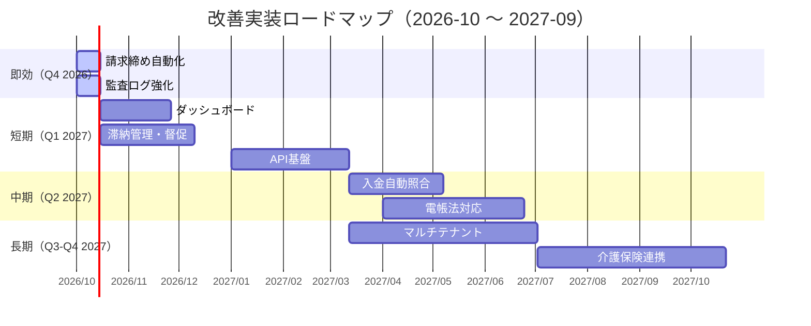

# 改善提案書：高齢者施設請求管理システム - 今後の開発方向性

**作成日**: 2026-10-07
**対象バージョン**: v1.0 "あんしん" 以降
**ステータス**: 検討中（未着手）

---

## 概要

現行システム（v1.0）は、入居者管理・月次請求生成・PDF/CSV発行・入金管理までの基幹機能を実装し、109テスト/862アサーション全通過の安定版として本番運用可能な状態です。本書は、運用実態・法制度対応・スケーラビリティを踏まえ、**今後 6-12 ヶ月で段階的に実装すべき 9 つの改善テーマ**を整理したものです。

---

## 改善テーマ一覧

| # | テーマ | 分類 | 優先度 | 工数目安 | 依存関係 |
|---|--------|------|--------|----------|----------|
| 1 | 請求締め処理の自動化スケジューラ | 運用効率化 | 🔴 **即効** | 1-2 週間 | なし |
| 2 | 入金消込の自動照合（口座振替データ取込） | 運用効率化 | 🟡 短期 | 1-2 ヶ月 | 1, 9 |
| 3 | 滞納管理・督促ワークフロー | 収益改善 | 🟡 短期 | 1-2 ヶ月 | 1, 7 |
| 4 | 電子帳簿保存法対応（タイムスタンプ・検索要件） | 法令対応 | 🟢 長期 | 3-6 ヶ月 | 9 |
| 5 | 複数施設・法人対応（テナント分離） | スケール | 🟢 長期 | 6 ヶ月〜 | 8 |
| 6 | 介護保険請求（介護給付費）連携機能 | 業務拡張 | 🟢 長期 | 6 ヶ月〜 | 5, 8 |
| 7 | ダッシュボード・経営分析レポート | 経営可視化 | 🟡 短期 | 1-2 ヶ月 | 1 |
| 8 | API ファースト化・外部連携基盤 | 連携基盤 | 🟡 短期 | 2-3 ヶ月 | 9 |
| 9 | 監査ログ・履歴管理の強化 | 内部統制 | 🔴 **即効** | 1-2 週間 | なし |

> **凡例**: 🔴 即効（1-2週間で効果発現） / 🟡 短期（1-3ヶ月） / 🟢 長期（3-6ヶ月以上）

---

## 詳細仕様

### 1. 請求締め処理の自動化スケジューラ

**課題**: 月初の請求生成・ステータス遷移が手動運用。担当者の忘れ・遅延リスクあり。

**解決案**:
- `app/Console/Commands/GenerateMonthlyInvoices.php` 作成
- `InvoiceCalculationService::generateForMonth(Carbon::now()->subMonth()->format('Y-m'))` を実行
- 完了後、ステータス `Unbilled` → `Billed` へ一括遷移（バルクアクション `markAsBilled` を流用）
- Laravel Scheduler (`app/Console/Kernel.php`) で `0 2 1 * *`（毎月 1 日 02:00）登録
- 実行結果をログ・メール・Slack 通知

**受け入れ基準**:
- [ ] 手動操作なしで前月分請求が確定する
- [ ] 実行失敗時にアラート通知される
- [ ] 重複実行時の冪等性が担保される

---

### 2. 入金消込の自動照合（口座振替データ取込）

**課題**: 口座振替結果（全銀フォーマット/CSV）を手動で突合・消込。件数増加に伴い工数・ミス増大。

**解決案**:
- `app/Services/PaymentReconciliationService.php` 新設
- 取込対応フォーマット: 全銀協統一フォーマット（固定長）・銀行別CSV
- 突合キー: `受取人名` + `金額` + `領収書番号`（請求書に印字済み）
- 完全一致 → 自動 `markAsPaid(PaymentMethod::DirectDebit)`
- 部分一致/未照合 → 照合候補リストとして管理画面提示（Filament `Infolist` + `Action`）
- 取込履歴・エラーログを `payment_reconciliation_logs` テーブルに記録

**受け入れ基準**:
- [ ] 全銀フォーマット・主要銀行 CSV の取込動作確認
- [ ] 照合率 95% 以上（テストデータで検証）
- [ ] 未照合分の手動消込フローが既存 UI で完結

---

### 3. 滞納管理・督促ワークフロー

**課題**: 支払期限超過の把握・督促が属人化。回収遅延・漏れが発生。

**解決案**:
- **期限判定**: `facility.billing.direct_debit_day`（口座振替日）+ `bank_transfer_due_days`（振込期限日数）から算出
- **検知**: 日次バッチで `status !== Paid` かつ `期限 < today` を抽出
- **アクション**:
  - 段階 1（期限+7日）: 督促状 PDF 生成・郵送/メール/LINE 送信履歴記録
  - 段階 2（期限+30日）: 担当者タスク化（Filament `Notifications` + `Tasks` プラグイン連携）
  - 段階 3（期限+60日）: 法的措置検討フラグ・管理者エスカレーション
- **可視化**: `MonthlyInvoiceResource` テーブルに「滞納日数」「督促段階」カラム追加

**受け入れ基準**:
- [ ] 滞納一覧が日次で自動更新される
- [ ] 督促状 PDF がワンクリックで生成・ダウンロードできる
- [ ] 段階別アクション履歴が監査ログ（テーマ 9）に残る

---

### 4. 電子帳簿保存法対応（タイムスタンプ・検索要件）

**課題**: 2024 年 1 月施行の改正電帳法（猶予期間終了）に対応必須。現行 PDF 保存のみでは要件不足。

**要件（国税庁ガイドライン準拠）**:
| 要件 | 対応方針 |
|------|----------|
| 真実性確保 | JIIMA 認証タイムスタンプ付与（外部 TSA 連携 or 自社 PKI） |
| 可視性確保 | 請求書・領収書を原本として保存（改変不可ストレージ推奨） |
| 検索機能 | 取引年月日・取引先・金額 の 3 要件で検索可能 |

**実装案**:
- `invoice_documents` テーブル新設（`monthly_invoice_id`, `document_type`, `file_path`, `timestamp_token`, `meta_json`）
- PDF 生成時 → TSA API 呼び出し → タイムスタンプトークンを PDF に埋め込み（PAdES）+ DB 記録
- 検索 API: `GET /api/v1/documents?date_from=&date_to=&partner=&amount_min=&amount_max=`
- Filament に「帳簿検索」リソース追加

**受け入れ基準**:
- [ ] 生成 PDF に有効なタイムスタンプが埋め込まれる
- [ ] 3 要件検索が 1 秒以内に応答する（インデックス設計済み）
- [ ] 税務調査想定のサンプル検査で不備なし

---

### 5. 複数施設・法人対応（テナント分離）

**課題**: 現行 `config/facility.php` + `facilities` テーブルは単一施設前提。法人本部での一元管理・施設間データ分離が不可。

**解決案**: **マルチテナント（シングル DB・行レベル分離）**
- `Facility` モデルをテナントエンティティ化
- 主要テーブルに `facility_id` 外部キー追加（`residents`, `charge_items`, `daily_charges`, `monthly_invoices`, `users` 等）
- `AppServiceProvider` で `Auth::user()->facility_id` を基にグローバルスコープ自動適用
- Filament: `TenantMiddleware` + `Panel::tenant()` で施設切替 UI 実装
- 権限: `FacilityAdmin`（自施設のみ）/ `CorporateAdmin`（全施設参照・集計のみ）

**移行戦略**:
1. `facility_id` カラム追加マイグレーション（デフォルト: 既存施設 ID）
2. 既存データへの一括付与
3. グローバルスコープ有効化
4. 施設作成・ユーザー割当 UI 実装

**受け入れ基準**:
- [ ] 施設ごとにデータが完全分離される（クロステナントアクセス不可）
- [ ] 法人管理者が横断集計レポートを閲覧できる
- [ ] 既存単一施設運用から無停止移行可能

---

### 6. 介護保険請求（介護給付費）連携機能

**課題**: 自費請求のみ対応。介護保険サービス（施設サービス・居宅サービス）の請求業務が別システム/手作業で二重管理。

**解決案**:
- **マスタ拡張**: `CareServiceItem`（サービスコード・単位数・単価・加算マスタ）、`CarePlan`（利用者×サービス×頻度）
- **実績入力**: `DailyCareRecord`（日付・サービス・実績単位数・担当職員）
- **集計**: 月次で `CareClaimService` → 国保連請求データ（CSV/EDI 形式）出力
- **連携**: 介護請求ソフト（ほのぼの/ケア樹/その他）へのインポート仕様対応
- **会計統合**: 介護給付費収入 + 自費収入 = 施設総売上としてダッシュボード（テーマ 7）に統合

**受け入れ基準**:
- [ ] 国保連請求データ（標準フォーマット）がエラーなく出力される
- [ ] 介護報酬改定（年 1 回）へのマスタ追従運用が確立される
- [ ] 自費・保険の売上内訳がリアルタイムに把握できる

---

### 7. ダッシュボード・経営分析レポート

**課題**: 経営判断に必要な指標（売上・稼働・滞納・損益）が可視化されておらず、CSV エクスポート→Excel 集計の手間あり。

**解決案**: Filament Widgets + Chart.js（`flowframe/laravel-trend` 等）でリアルタイム可視化
| ウィジェット | 指標 | 更新頻度 |
|-------------|------|----------|
| 月次売上推移 | 総請求額・入金額・未収額（自費/保険別） | 日次 |
| 稼働率・入居率 | 部屋数・入居中人数・平均在籍日数 | 日次 |
| 自費内訳 | 請求項目別売上 TOP10 / トレンド | 月次 |
| 滞納サマリ | 滞納件数・金額・段階別内訳・回収率 | 日次 |
| 施設別損益 | 収入（自費+保険）- 変動費- 固定費 | 月次 |

**受け入れ基準**:
- [ ] 管理画面トップ（`/admin`）にダッシュボード表示
- [ ] 期間・施設フィルタで任意スライス可能
- [ ] 印刷・PDF エクスポート対応

---

### 8. API ファースト化・外部連携基盤

**課題**: 会計ソフト・ケアプランシステム・見守りセンサー等との連携が CSV 手動受渡し。二重入力・タイムラグ・ミス発生。

**解決案**: Laravel Sanctum + `spatie/laravel-api-response` で REST API 公開
| エンドポイント | 用途 | 連携先例 |
|---------------|------|----------|
| `GET /api/v1/residents` | 入居者マスタ同期 | ケアプラン・見守り・ナースコール |
| `GET /api/v1/invoices?month=` | 請求確定データ取得 | 会計ソフト（freee/MF/弥生） |
| `POST /api/v1/payments` | 入金実績受信 | 銀行 API / 決済代行 |
| `GET /api/v1/daily-charges` | 日次利用料明細 | 介護記録・請求チェック |
| `POST /api/v1/webhooks/invoice-status` | ステータス変更通知 | 外部ワークフロー |

- API トークン管理: 施設単位・スコープ別（読取専用/書込可）
- OpenAPI (Swagger) ドキュメント自動生成（`darkaonline/l5-swagger`）
- Webhook 署名検証・リトライ・冪等性キー対応

**受け入れ基準**:
- [ ] 主要 3 連携先（会計・ケアプラン・銀行）で PoC 完了
- [ ] API レスポンス p95 < 500ms
- [ ] 開発者向けドキュメントが自動公開される

---

### 9. 監査ログ・履歴管理の強化

**課題**: 現行は `MonthlyInvoice.version`（楽観ロック用）のみ。金額修正・ステータス変更・削除等の「誰が・いつ・何を・どう変更」が追跡不可。内部統制・監査対応不足。

**解決案**: `spatie/laravel-activitylog` 導入
- 対象モデル: `Resident`, `MonthlyInvoice`, `DailyCharge`, `ChargeItem`, `Facility`, `TaxSetting`, `User`
- 記録項目: `causer_id`, `subject_type`, `subject_id`, `event` (created/updated/deleted), `properties` (old/new), `description`
- UI: Filament リレーションマネージャで各レコードの「変更履歴」タブ表示
- 保持期間: 7 年（法定保存期間準拠）→ パーティショニング・アーカイブ戦略検討

**受け入れ基準**:
- [ ] 全重要操作のログが漏れなく記録される
- [ ] 任意時点のデータ復元（ポイントインタイムリカバリ）手順書化
- [ ] 監査人からのサンプル要求に 1 時間以内で応答可能

---

## 実装ロードマップ

---

## リソース・体制想定

| フェーズ | 必要スキル | 推奨体制 |
|---------|------------|----------|
| 即効 | Laravel 基礎、Scheduler、Activitylog | 1 名（バックエンド） |
| 短期 | Filament Widgets、Chart.js、API 設計 | 2 名（BE + FE/Widget） |
| 中期 | 全銀フォーマット、TSA 連携、セキュリティ | 2-3 名（BE + インフラ） |
| 長期 | マルチテナント設計、介護報酬知識、EDI | 3-4 名（BE + ドメイン専門） |

---

## リスク・留意事項

| リスク | 影響度 | 対策 |
|--------|--------|------|
| 介護報酬改定（年 1 回）への追従遅延 | 高 | テーマ 6 着手前に「改定対応フロー」を別途文書化 |
| 電帳法タイムスタンプの運用コスト（TSA 契約費） | 中 | 無料 TSA（セイコータイムスタンプ等）検証→有料移行判断 |
| マルチテナント移行時のデータ分離不備 | 高 | ステージングで全テナント組合せテスト実施・Rls ポリシー併用検討 |
| API 公開によるセキュリティインシデント | 高 | WAF・レートリミット・監査ログ必須・ペネトレーションテスト実施 |

---

## 次アクション

1. **即効 2 テーマ（1, 9）の着手判断** → 担当アサイン・スプリント計画
2. **ステークホルダー合意** → 経営層・現場責任者・顧問税理士との優先度すり合わせ
3. **詳細設計着手** → 各テーマの `SPEC.md` 作成・レビューサイクル確立
4. **予算確保** → 外部連携（TSA・API・EDI）費用見積もり

---

## 関連ドキュメント

- [README.md](README.md) - プロジェクト概要・セットアップ
- [DEPLOYMENT.md](DEPLOYMENT.md) - デプロイ手順・チェックリスト
- [CHANGELOG.md](CHANGELOG.md) - 変更履歴
- `app/Services/InvoiceCalculationService.php` - 請求集計ロジック（テーマ 1, 3 の基盤）
- `app/Services/InvoicePdfService.php` - PDF生成（テーマ 2, 3, 4 の基盤）
- `app/Models/MonthlyInvoice.php` - 請求モデル（テーマ 9 の対象）

---

*本書は継続的に更新されます。提案内容・優先度は運用フィードバック・法改正・事業計画に応じて見直します。*