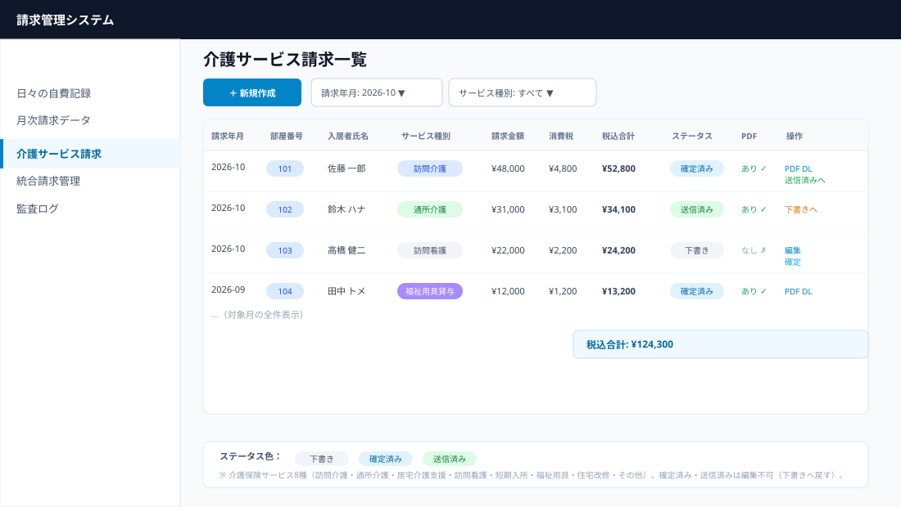
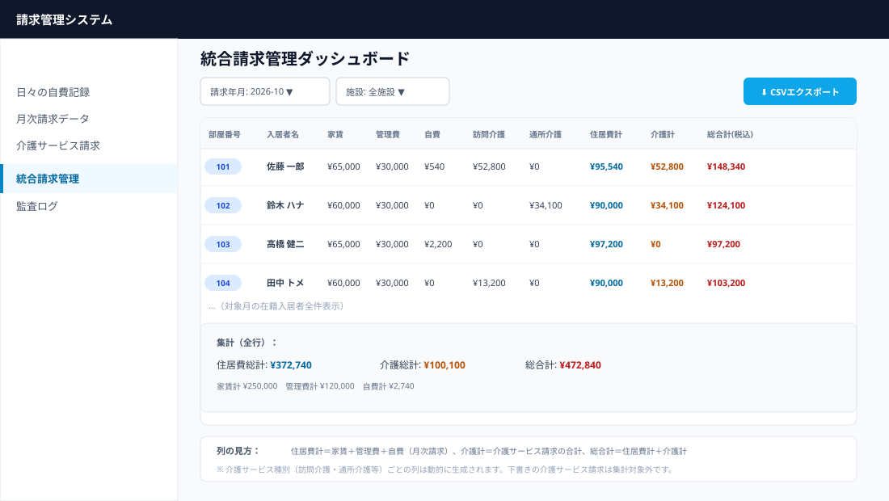
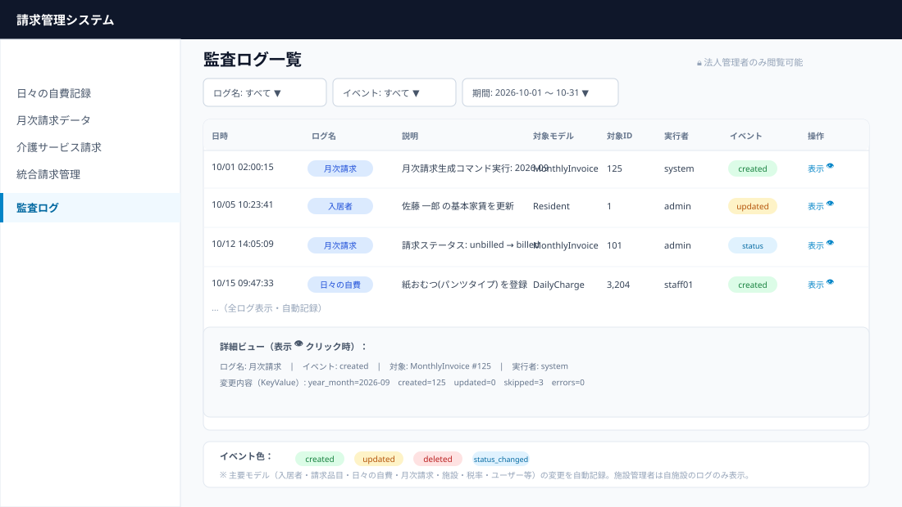
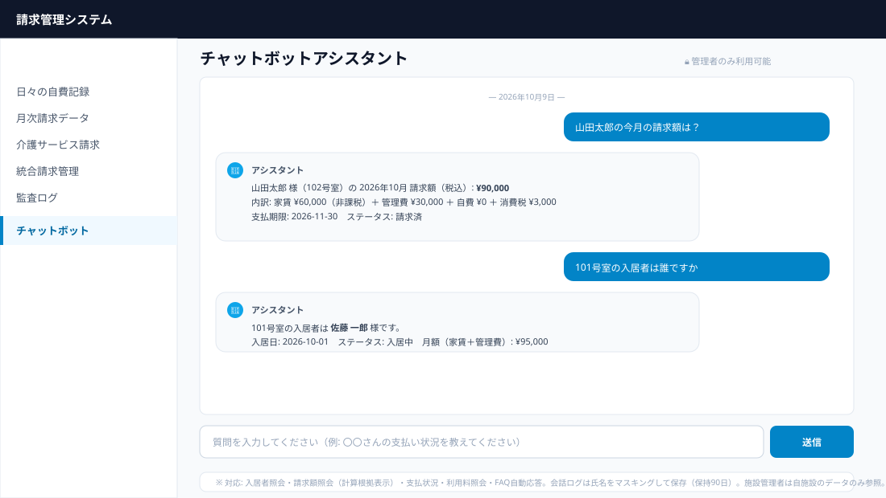

# 高齢者施設請求管理システム **あんしん ver1.5**

高齢者施設の月次請求・領収書発行、入居者管理、日々の利用料管理を一元化するシステムです。Laravel 12 + Filament v3 で構築されています。

## バージョン情報

**現在のバージョン: v1.5 "あんしん" (2026-10-09)**

- 全 **461 テスト通過（2006 アサーション）**
- **自動月次請求生成コマンド**（`billing:generate-monthly`、スケジューラ登録済み・毎月1日自動実行）
- **バックアップ/DR対応**（`backup:database` / `backup:restore` コマンド、毎日 03:00 自動バックアップ、DR手順書 `docs/DR_PROCEDURE.md`）
- **介護サービス請求管理**（ServiceInvoice・8種類の介護保険サービス種別・PDF結合対応）
- **統合請求管理ダッシュボード**（住居費＋介護サービスの総合計・CSV出力対応）
- **監査ログ・アクティビティログ**（spatie/laravel-activitylog・主要モデル対応・FacilityAdmin/全体管理者権限分離）
- **ダッシュボード**（請求進捗・未入金者一覧・クイック統計）を追加
- **セットアップウィザード**（5ステップ初期導入・CSV一括取込・会計ソフト連携設定）を追加
- **PDFアーキテクチャ刷新**（DTO・サービス層の分離、Noto Sans JP フォント対応）
- **請求計算サービスのリファクタリング**（日割り/定期課金/税計算を専用クラスに分離、チャンク処理でメモリ効率化）
- **請求書・領収書の日付モード**（自動/任意の日付指定）に対応
- **税額内訳の詳細化**（標準税率10%・軽減税率8%の別々管理）
- **FacilityConfigService**（施設設定のDB優先・統一アクセス）
- 施設管理・税率設定・PDFテンプレート設定機能、会計連携CSV、セルフサーブ・トライアル、商用ウェブサイトを継続搭載

---

## デモ：5分でわかる請求業務の流れ

> このデモでは、架空の施設「**ケアレジデンス ひまわり**」（定員25名）の **2026年10月** の請求業務を、実際の数字を交えて追います。

### シナリオ

| 項目 | 値 |
| --- | --- |
| 施設名 | ケアレジデンス ひまわり |
| 対象月 | 2026年10月（31日） |
| 入居者 | 佐藤 一郎様（101号室・入居日 2026-10-01） |
| 基本家賃 | ¥65,000/月（**非課税**） |
| 基本管理費 | ¥30,000/月（**課税10%**） |
| 自費利用 | 紙おむつ（パンツタイプ）¥180 × 3枚/日 × 30日分 |

### Step 1｜日々の自費記録を入力する（毎日）

介護職員が「日々の自費記録」から、紙おむつの利用を記録します。品目を選ぶと**単価が自動反映**されます。

```
日付: 2026-10-01  入居者: 佐藤 一郎  品目: 紙おむつ(パンツタイプ)
単価: ¥180（自動）  数量: 3  →  小計: ¥540（自動計算）
```

これを30日分行うと、自費小計は **¥540 × 30 = ¥16,200** になります。

### Step 2｜月次請求データを一括生成する（翌月1日以降）

「月次請求データ」→「🧮 10月の請求データを一括生成する」をクリック。システムが自動で計算します。

**自動計算ロジック（日割り）**:

```
在籍日数 = 31日（10/1〜10/31）
家賃   = round(65,000 ÷ 31 × 31) = ¥65,000  （非課税）
管理費 = round(30,000 ÷ 31 × 31) = ¥30,000  （課税10%）
自費   = ¥16,200                              （課税10%）
```

**税計算（v1.3で標準/軽減を別管理）**:

```
課税対象額 = 管理費 + 自費 = 30,000 + 16,200 = ¥46,200
消費税額   = round(46,200 × 10%) = ¥4,620
税込合計   = 65,000 + 46,200 + 4,620 = ¥115,820
```

生成結果の通知:

```
【2026-10分】
新規作成: 25件
再計算更新: 0件
スキップ(確定済): 0件
```

### Step 3｜ダッシュボードで進捗を確認する（v1.3 新機能）

「ダッシュボード」では、対象月の請求進捗が一目で分かります。

```
┌─────────────────────────────────────────────┐
│  2026年10月 請求進捗                        │
│  ████████████░░░░░░░░  進捗 48%             │
│                                             │
│  対象: 25件  請求済: 12件  未請求: 13件     │
│  入金済: 5件                                │
│                                             │
│  ⚠ 未入金アラート: 7件                      │
└─────────────────────────────────────────────┘
```

未入金の入居者一覧も表示されるため、督促対象をすぐに把握できます。

### Step 4｜請求書PDFを出力する

一覧の「📥 請求書PDF」で個別出力、「📦 一括PDF(ZIP)出力」で全員分をZIPでダウンロード。

**請求書の構成**:

```
┌─────────────────────────────────────────────┐
│  請求書                                     │
│  請求番号: INV-202610-001                   │
│  ─────────────────────────────────────────  │
│  【宛先】101号室 佐藤 一郎 様               │
│  【発行者】ケアレジデンス ひまわり          │
│           インボイス登録番号: T1234567890123│
│  ─────────────────────────────────────────  │
│  ご請求金額（税込）  ¥115,820               │
│   ├ 基本家賃（非課税）      ¥65,000         │
│   ├ 管理費（課税10%）       ¥30,000         │
│   ├ 自費サービス（課税10%） ¥16,200         │
│   └ 消費税額（10%）          ¥4,620         │
│  ─────────────────────────────────────────  │
│  日々の自費サービス利用明細                  │
│   10/01 紙おむつ(パンツ) ¥180×3 = ¥540     │
│   ...（30日分）                             │
│  ─────────────────────────────────────────  │
│  お支払期限: 2026-11-30                     │
│  振込先: 〇〇銀行 〇〇支店 普通 1234567     │
└─────────────────────────────────────────────┘
```

### Step 5｜一括「請求済」に変更する

請求書を送付したら、チェックボックスで選択し「一括『請求済』に変更」。これで**確定保護**され、編集・削除できなくなります。

### Step 6｜入金消込 → 領収書PDF

入金を確認したら「✅ 入金消込」から入金日・入金区分を選択。ステータスが「入金済」になり、**領収書番号が自動発行**されます。

```
入金消込が完了しました (領収書番号: REC-202610-0001)
```

入金済のレコードに「🧾 領収書PDF」が表示され、領収書を発行できます。

### Step 7｜会計ソフトにCSVを出力する

「📊 会計CSV出力」から、会計ソフト別（freee/MF/弥生/勘定奉行）の仕訳CSVを出力。**v1.2** で追加されたプロファイル機能により、会計ソフトごとの文字コード・改行コード・BOMを自動調整します。

```
借方: 売掛金 ¥115,820
貸方: 賃貸料収入 ¥65,000 / 施設管理費収入 ¥30,000 / 自費立替金収入 ¥16,200 / 消費税額 ¥4,620
```

### 業務フロー全体（図）


> 💡 **月途中の入居・退去も自動で日割り計算**されます。例: 31日の月に15日間在籍 → 月額 ÷ 31 × 15（四捨五入）。詳細は[操作マニュアル](docs/操作マニュアル.md)第10章を参照してください。

---

## 機能概要

- **入居者管理** — 部屋番号、基本家賃・管理費、入居/退居日、ステータス管理
- **請求項目管理** — 家賃・管理費以外の請求項目（立替金・日用品など）の既定金額管理
- **日次利用料管理** — 日ごとの利用料記録（請求項目 × 数量 × 金額）
- **月次請求書生成** — 月次請求額の自動集計・請求書発行（`InvoiceCalculationService`）
- **PDF発行** — 請求書・領収書のPDF生成、月次ZIP一括ダウンロード（`InvoicePdfService`）
- **CSVエクスポート** — 月別リストCSV / 会計仕訳CSV（`InvoiceCsvExportService`、未請求は会計仕訳から除外）
- **入金管理** — 支払方法の記録、請求書ステータス遷移（Unbilled → Billed → Paid）
- **ダッシュボード** — 請求進捗・未入金者・クイック統計（v1.3 新機能）
- **セットアップウィザード** — 初期導入を5ステップでガイド（v1.3 新機能）
- **チャットボット** — 職員向けFAQ自動応答・入居者/請求照会（`/admin/chatbot`）
- **PDFパスワード保護** — 請求書・領収書PDFの暗号化（固定パスワード/生年月日8桁）

---

## チャットボット（職員向け内部ツール）

管理画面左メニュー「チャットボット」から利用可能な職員向けアシスタントです。

**利用方法**: `/admin/chatbot` にアクセスし、質問を入力します。

**対応機能**:
- **入居者照会** — 「山田太郎の情報を教えてください」「101号室の入居者は？」
- **請求額照会** — 「山田太郎の今月の請求額はいくらですか」（日割り計算の根拠も表示）
- **支払状況** — 「山田太郎の支払い状況を教えてください」
- **利用料照会** — 「山田太郎の月額利用料はいくらですか」
- **FAQ自動応答** — 「チャットボットFAQ」管理画面で登録した質問に自動応答

**セキュリティ**:
- 管理者のみ利用可能（`is_admin`）
- 施設管理者は所属施設のデータのみ参照可能（他施設の情報にはアクセス不可）
- 会話ログは氏名をマスキングして保存、保持期間は90日（`config/chatbot.php` で設定）

**FAQ管理**: 「設定」→「チャットボットFAQ」で質問・キーワード・回答を登録します。キーワードの一致数でスコアリングされ、最も一致するFAQが回答されます。施設共通（施設未選択）と施設固有のFAQを登録可能です。

---

## 管理画面デモ / スナップショット

> **注意**: PNG画像（`docs/screenshots/`）はプレースホルダです。実際のスクリーンショットに差し替えてご利用ください。
> 撮影手順: `php artisan serve` 後、`http://localhost:8000/admin` にアクセスし、各リソース画面でスクリーンショットを撮影して `docs/screenshots/` 以下に保存してください。
> **v1.5 以降の新機能は SVGモックアップ（`docs/assets/`）を参照**できます（GitHub上でそのまま表示されます）。

### 0. ダッシュボード (`Dashboard`) — **v1.3 新機能**

| 画面 | 説明 |
|------|------|
|  | **ダッシュボード** — 対象月の請求進捗バー、件数サマリー（対象/請求済/未請求/入金済）、未入金アラート、クイック統計を表示。年月セレクタで過去12ヶ月＋未来3ヶ月を切替可能。施設管理者は自施設のみ表示。 |

**主な機能**: 請求進捗の可視化、未入金者の早期発見、年月別の推移確認

---

### 1. 入居者管理 (`ResidentResource`)

| 画面 | 説明 |
|------|------|
|  | **一覧画面** — 部屋番号・氏名・ステータス・家賃・管理費をテーブル表示。ステータスバッジ（入居中/退去済/予約中）で即座に把握。フィルタで「入居中のみ」「退去済みのみ」切替可能。 |
|  | **作成/編集モーダル** — 基本情報（氏名・部屋番号・家賃・管理費）、入居日/退去日、ステータスを一括入力。退去日は入居日以降のみ入力可（バリデーション内蔵）。 |
|  | **詳細画面** — 入居者の基本情報、関連する日次利用料、月次請求書の履歴をタブ切替で確認。 |

**主な Filament 機能**: Table Bulk Actions（一括ステータス変更）、インライン編集、リレーションマネージャ（日次利用料・月次請求書）

---

### 2. 請求項目管理 (`ChargeItemResource`)

| 画面 | 説明 |
|------|------|
|  | **一覧画面** — 項目名・単価・税区分（課税/非課税）・施設紐付けを表示。施設ごとの既定単価を管理。 |
|  | **作成/編集フォーム** — 名称、単価、税区分、施設選択。施設を選ぶとその施設専用の項目として登録。 |

**用途**: 立替金、日用品、レクリエーション費、医療費等の定型外請求項目をマスタ管理

---

### 3. 日次利用料管理 (`DailyChargeResource`)

| 画面 | 説明 |
|------|------|
|  | **一覧画面** — 日付・入居者・請求項目・数量・金額・税額を表示。月別フィルタ・入居者フィルタで絞込み。 |
|  | **作成フォーム** — 入居者選択 → 請求項目選択（単価自動反映）→ 数量入力 → 金額自動計算。複数行一括登録対応。 |

**特徴**: 請求項目の単価を参照し、数量変更時に金額・税額をリアルタイム再計算

---

### 4. 月次請求書生成 (`MonthlyInvoiceResource`)

| 画面 | 説明 |
|------|------|
|  | **一覧画面** — 請求月・入居者・請求額・税額・ステータス（未請求/請求済/入金済）を表示。ステータス別集計サマリー付き。 |
|  | **生成アクション** — 「請求書生成」ボタンで対象月・施設を指定し一括生成。生成ログ（件数・合計額）をトースト通知。 |
|  | **詳細画面** — 明細内訳（家賃・管理費・日次利用料・税額）、PDFダウンロード、ステータス遷移ボタン（請求確定/入金記録）。 |

**v1.3 新機能**: 請求書日付モード（自動/任意指定）、領収書日付モード、税額内訳（標準/軽減税率別）の詳細管理

**バックエンド**: `InvoiceCalculationService` が月途中入居/退去を日割り計算、税率は `TaxSetting` を参照

---

### 5. PDF発行・ZIP一括ダウンロード (`InvoicePdfService`)

| 画面 | 説明 |
|------|------|
|  | **請求書PDFプレビュー** — 施設名・登録番号・請求先・明細・合計・振込先銀行情報をレイアウト。インボイス制度対応（登録番号・税率別内訳表示）。 |
|  | **領収書PDF** — 領収書番号（`%04d` 連番）、但書（家賃等）、収入印紙欄（5万円以上対応）。 |
|  | **月次ZIP一括ダウンロード** — 選択月の全入居者分を1つのZIPにまとめてダウンロード。ファイル名は `請求書_施設名_YYYYMM_入居者名.pdf` 形式。 |

**技術詳細**: `dompdf` + 日本語フォント（Noto Sans JP）、一時ディレクトリは `try/finally` で確実クリーンアップ

---

### 6. CSVエクスポート (`InvoiceCsvExportService`)

| 画面 | 説明 |
|------|------|
|  | **月別リストCSV** — 入居者ごとの請求額内訳を横持ち出力。会計ソフト取込用フォーマット。 |
|  | **会計仕訳CSV** — 複式簿記対応の仕訳行（借方/貸方・勘定科目・金額・税区分）を出力。**Billed/Paid のみ対象**（未請求は除外）。 |

**出力例**: `docs/samples/monthly_list_2026-10.csv`, `docs/samples/accounting_2026-10.csv`

---

### 7. 入金管理（ステータス遷移）

| 画面 | 説明 |
|------|------|
|  | **ステータス遷移フロー** — `Unbilled` → `Billed`（請求確定） → `Paid`（入金確認）。各遷移で確認モーダル表示。 |
|  | **入金記録モーダル** — 支払日・支払方法（現金/振込/口座振替/その他）・備考を入力。`Paid` 遷移時に自動記録。 |

---

### 8. 施設管理 (`FacilityResource`)

| 画面 | 説明 |
|------|------|
|  | **一覧画面** — 施設名・運営者・所在地・電話・インボイス登録番号・銀行口座を一覧。 |
|  | **作成/編集フォーム** — 基本情報、インボイス登録番号（T+13桁バリデーション）、銀行口座（銀行名・支店・種別・番号・名義）。 |

**役割**: 複数施設運営の基盤。請求書PDFのヘッダー情報・振込先として使用。

---

### 9. 税率設定 (`TaxSettingResource`)

| 画面 | 説明 |
|------|------|
|  | **一覧画面** — 税率・適用開始日・適用終了日・施設を表示。期間重複チェック機能付き。 |
|  | **作成フォーム** — 税率（%）、適用期間、施設選択。終了日未入力で「現在適用中」扱い。 |

**連携**: `InvoiceCalculationService` が請求月時点での有効税率を自動選択

---

### 10. PDFテンプレート設定 (`PdfTemplateSettingsResource`)

| 画面 | 説明 |
|------|------|
|  | **一覧画面** — テンプレート名・種別（請求書/領収書）・施設・デフォルトフラグを表示。 |
|  | **編集画面** — Blade テンプレートコードをエディタで編集（シンタックスハイライト付き）。プレビューボタンで即時確認。 |

**カスタマイズ項目**: ヘッダーロゴ位置、明細テーブル列幅、フッター備考欄、フォントサイズ、ロケール・テーマ、日付モード等

---

### 11. セットアップウィザード (`OnboardingWizard`) — **v1.3 新機能**

| 画面 | 説明 |
|------|------|
|  | **5ステップの初期導入ガイド** — ①施設情報 ②請求品目の選択（プリセット6種） ③入居者CSV一括取込 ④会計ソフト連携設定 ⑤完了。 |

**特徴**: プリセット品目（おむつ・理美容・受診付き添い等）のワンクリック追加、入居者CSVのプレビュー付き一括取込、会計ソフト（freee/MF/弥生/勘定奉行）のプロファイル自動作成

---

### 12. 介護サービス請求 (`ServiceInvoiceResource`) — **v1.5 新機能**（SVGモックアップ）

| 画面 | 説明 |
|------|------|
|  | **一覧画面** — 介護保険サービス8種（訪問介護・通所介護・居宅介護支援・訪問看護・短期入所・福祉用具・住宅改修・その他）の外部請求を一覧表示。ステータスバッジ（下書き/確定済み/送信済み）、外部システム名・外部請求番号、PDFあり/なし表示。 |

**主な操作**: PDFダウンロード、確定、送信済みにする（送信経路: メール/ZIP配布/ポータル/手渡し）、下書きに戻す、一括確定・一括送信済み。確定済み・送信済みは編集不可（下書きへ戻す必要あり）

---

### 13. 統合請求管理ダッシュボード (`IntegratedBillingDashboard`) — **v1.5 新機能**（SVGモックアップ）

| 画面 | 説明 |
|------|------|
|  | **統合請求管理** — 住居費（家賃・管理費・自費）と介護サービス請求を入居者別に一覧表示。介護サービス種別ごとの金額列を動的生成し、住居費計＋介護計＝総合計（税込）をリアルタイム集計。行単位・全行の合計サマリー付き。 |

**主な操作**: 請求年月・施設フィルタ、CSVエクスポート（BOM付きUTF-8・Excel対応）。月次請求がない在籍入居者も表示（金額0円）

---

### 14. 監査ログ (`ActivityLogResource`) — **v1.5 新機能**（SVGモックアップ）

| 画面 | 説明 |
|------|------|
|  | **一覧画面** — 主要モデル（入居者・請求品目・日々の自費・月次請求・施設・税率・ユーザー等）の変更履歴を自動記録・表示。イベントバッジ（created/updated/deleted/status_changed）、対象モデル・実行者・変更内容（KeyValue）を確認可能。 |

**閲覧権限**: 法人管理者は全件、施設管理者は自施設のみ。フィルタでログ名・イベント・期間・施設を絞り込み。月次請求の自動生成結果も記録

---

### 15. チャットボット (`ChatbotAssistant`) — **新機能**（SVGモックアップ）

| 画面 | 説明 |
|------|------|
|  | **チャットボットアシスタント** — 職員向けFAQ自動応答・入居者/請求照会。入居者照会・請求額照会（日割り計算の根拠も表示）・支払状況・利用料照会に自然言語で応答。 |

**対応機能**: 入居者照会、請求額照会、支払状況、利用料照会、FAQ自動応答（キーワード一致スコアリング）。管理者のみ利用可能、施設管理者は自施設のデータのみ参照、会話ログは氏名マスキング保存（保持90日）

---

## 技術スタック

| 項目 | 内容 |
| --- | --- |
| PHP | 8.3+ |
| Laravel | 12.x |
| Filament | v3（管理パネル） |
| PDF | dompdf/dompdf |
| テスト | Pest（SQLite `:memory:`） |
| DB | 本番: MySQL/SQLite / テスト: SQLite インメモリ |
| デプロイ | Docker / Railway / Caddy |

## セットアップ手順

```bash
# 1. 依存関係のインストール
composer install

# 2. 環境変数の設定
copy .env.example .env
php artisan key:generate

# 3. マイグレーション & シード
php artisan migrate --seed

# 4. 開発サーバー起動
php artisan serve
```

Windows 環境では `start-project.bat` を使用することで PHP/Composer のパス設定込みで起動できます。

管理画面: `http://localhost:8000/admin`（`is_admin = true` のユーザーのみアクセス可能）

### セットアップウィザード（v1.3 新機能）

初回導入時は「セットアップウィザード」からも設定できます。

1. 施設情報の入力（施設名・運営法人・インボイス登録番号・銀行口座）
2. 請求品目の選択（プリセット6種をワンクリック追加）
3. 入居者CSVの一括取込（プレビュー付き）
4. 会計ソフト連携設定（freee/MF/弥生/勘定奉行）
5. 完了

### 施設情報の設定

`.env` で以下を設定してください。起動時（`AppServiceProvider::validateFacilityConfig`）に妥当性検証されます。

- `FACILITY_NAME`, `FACILITY_OPERATOR`, `FACILITY_POSTAL_CODE`, `FACILITY_ADDRESS`, `FACILITY_PHONE`, `FACILITY_FAX`, `FACILITY_EMAIL`
- `FACILITY_INVOICE_NUMBER` — 登録番号（`T` + 13桁、例: `T1234567890123`）
- `FACILITY_BANK_*` — 銀行口座情報（振込先として請求書PDFに表示）
- `FACILITY_DEBIT_DAY`, `FACILITY_TRANSFER_DUE_DAYS`

> 💡 **v1.3**: 施設設定は `FacilityConfigService` 経由で DB（`facilities` テーブル）を優先的に参照します。DBに施設がない場合は `.env` の設定にフォールバックします。

## テスト

```bash
# 全テスト実行（SQLite :memory:）
php artisan test
# または
vendor\bin\pest
```

テストスイート構成:

- `tests/Unit` — モデル単体テスト（DailyCharge, MonthlyInvoice, Resident 等）
- `tests/Feature` — サービス・Filament・ルートの統合テスト
- `tests/Feature/Regression` — リグレッションテスト（税計算・按分・ロック・境界値）
- `tests/Unit/Pdf` — PDF DTO・データプロバイダ・ジェネレータの単体テスト

**v1.3 時点で 350 テスト / 1666 アサーションが全て通過しています。**

## ディレクトリ構成（主要ファイル）

```
app/
├── Enums/            InvoiceStatus, ResidentStatus, PaymentMethod
├── DTOs/Pdf/         InvoicePdfData, ReceiptPdfData, FacilityPdfData, ...
├── Filament/
│   ├── Pages/        Dashboard, OnboardingWizard
│   └── Resources/    Resident / ChargeItem / MonthlyInvoice / Facility / TaxSetting / PdfTemplateSettings
├── Models/           Resident, ChargeItem, DailyCharge, MonthlyInvoice, User, Facility, TaxSetting
├── Providers/        AppServiceProvider（施設設定検証）, PdfServiceProvider
└── Services/
    ├── InvoiceCalculationService.php   月次請求集計（オーケストレーション）
    ├── Invoice/                        請求計算の専用クラス群
    │   ├── DailyChargeAggregator.php   日次課金の税区分別集計
    │   ├── RecurringChargeAggregator.php 定期課金の集計
    │   ├── ProrationCalculator.php     日割り計算
    │   ├── TaxCalculator.php           税率・税額計算
    │   └── InvoicePersister.php        請求データの永続化（チャンク処理）
    ├── FacilityConfigService.php       施設設定の統一アクセス
    ├── InvoicePdfService.php           PDF生成・ダウンロード・ZIP
    ├── InvoiceCsvExportService.php     CSVエクスポート
    └── Pdf/                            PDFアーキテクチャ
        ├── InvoicePdfGenerator.php     PDF生成の統合インターフェース
        ├── TemplateSettingsService.php テンプレート設定管理
        ├── DataProviders/              PDFデータの構築
        ├── Fonts/WindowsFontRegistry.php フォント管理
        ├── Renderers/                  DomPdfRenderer, HtmlRenderer
        └── Templates/                  InvoiceTemplate, ReceiptTemplate
database/migrations/   入居者・請求項目・日次利用料・月次請求書テーブル
```

## 主な実装済み機能

### データ整合性・リソース管理
- 月次請求生成の対象住民フィルタ修正（月途中入居・退去も正しく対象に含める）
- PDF ZIP生成時の一時ディレクトリ確実なクリーンアップ（`try/finally`）
- MonthlyInvoice Observer 削除による二重計算防止、モデル `booted` への集約
- 管理画面アクセス制御を `is_admin === true` のみに限定

### 請求計算・PDF・CSV
- 月次請求集計ログ出力（開始・完了）
- PDF生成ロジック統合（`generatePdfFromInvoice`）、専用コントローラ削除
- 領収書番号フォーマット `%04d`（9999件まで対応）
- 会計仕訳CSVは Billed/Paid ステータスのみ対象

### バリデーション・UX
- 退去日バリデーション（入居日以降必須）
- 施設設定の起動時検証（インボイス登録番号・銀行情報）
- Resident モデル `$fillable` 明示化

### データベース
- `residents.move_in_date` / `move_out_date` インデックス追加
- `users.is_admin` nullable 対応
- 日付比較を 'Y-m-d H:i:s' 形式に統一（境界値取りこぼし防止）
- `monthly_invoices` に `version` / 税関連カラム追加
- **v1.3**: 複合インデックス追加（月次請求・日次利用料・入居者）、税額内訳（`tax_breakdown`）カラム

## デプロイ

デプロイ手順・チェックリスト・ロールバック手順は [DEPLOYMENT.md](DEPLOYMENT.md) を参照してください。

**v1.3**: Docker（`Dockerfile`）、Caddy（`Caddyfile`）、Railway（`railway.json`）での本番デプロイに対応。`.env.production.example` を参考に環境変数を設定してください。

変更履歴は [CHANGELOG.md](CHANGELOG.md) を参照してください。

---

## 変更履歴 v1.3 (2026-10-09)

### 新機能
- **ダッシュボード** (`Dashboard`) — 請求進捗バー、件数サマリー（対象/請求済/未請求/入金済）、未入金アラート、クイック統計。年月セレクタで過去12ヶ月＋未来3ヶ月を切替。施設管理者は自施設のみ表示
- **セットアップウィザード** (`OnboardingWizard`) — 5ステップの初期導入ガイド
  - 施設情報入力、請求品目プリセット選択（6種）、入居者CSV一括取込（プレビュー付き）、会計ソフト連携設定、完了
- **請求書・領収書の日付モード** — `invoice_date_mode` / `receipt_date_mode`（自動/任意指定）に対応。任意の日付を指定可能
- **税額内訳の詳細化** — `tax_breakdown` で標準税率（10%）・軽減税率（8%）を別々に管理・表示

### アーキテクチャ改善
- **PDFアーキテクチャ刷新** — DTO（`InvoicePdfData` 等）とサービス層（`Services/Pdf/`）を分離
  - `InvoicePdfGenerator`（統合インターフェース）、`TemplateSettingsService`、`WindowsFontRegistry`
  - `RendererInterface` / `TemplateInterface` / `FontRegistryInterface` による拡張性
- **請求計算サービスのリファクタリング** — `InvoiceCalculationService` をオーケストレーションに特化
  - `DailyChargeAggregator` / `RecurringChargeAggregator` / `ProrationCalculator` / `TaxCalculator` / `InvoicePersister` に分離
  - チャンク処理（`chunkById`）によるメモリ効率化、トランザクションはチャンク単位
- **FacilityConfigService** — 施設設定の統一アクセス（DB優先・configフォールバック）
- **PdfTemplateSettingsResource** — テンプレート設定リソースのリネーム・強化（ロケール・テーマ・日付モード）

### フォント・デザイン
- **Noto Sans JP** フォント対応（`storage/fonts/` に同梱）
- PDF用CSS（`resources/css/pdf-invoice.css` / `pdf-receipt.css`）の整備
- 空状態ビュー（`list-empty.blade.php`）の追加

### デプロイ基盤
- `Dockerfile` / `Caddyfile` / `railway.json` / `.env.production.example` / `.dockerignore`

### テスト拡充
- PDF DTO・データプロバイダ・ジェネレータ・フォントレジストリの単体テスト
- モデルテストの大幅拡充（Facility, ChargeItem, ChartOfAccount, Trial, Subscription, Booking 等）
- **全 350 テスト / 1666 アサーション**（v1.2 の 183 テストから拡充）

### 備考
v1.2 からの破壊的変更なし。既存データ・テストは全て互換性維持。

---

## 変更履歴 v1.5 (2026-10-09)

### 新機能
- **自動月次請求生成コマンド** (`billing:generate-monthly`) — 毎月1日 02:00 に前月分を自動生成（本番/ステージング環境のみ）。オプション: `--year-month`, `--facility-id`, `--force`, `--dry-run`。進捗バー・結果テーブル・アクティビティログ記録対応
- **バックアップ/DR対応** (`backup:database` / `backup:restore`) — データベースダンプ＋ストレージのフルバックアップ（ZIP圧縮・保持期間管理・S3オフサイトアップロード対応）、`--dry-run` による安全なリストア検証。毎日 03:00 にスケジューラ自動実行（production/staging）。DR手順書は `docs/DR_PROCEDURE.md`（RPO 24時間 / RTO 4時間）
- **介護サービス請求管理** (`ServiceInvoice`, `ServiceType`) — 介護保険サービス8種（訪問介護・通所介護・居宅介護支援・訪問看護・短期入所・福祉用具・住宅改修・その他）に対応。ステータス管理（下書き/確定済み/送信済み）、外部システム連携（外部システム名・外部請求番号）、PDFアップロード・ダウンロード
- **統合請求管理ダッシュボード** (`IntegratedBillingDashboard`) — 住居費（家賃・管理費・自費）と介護サービス請求を一覧表示。サービス種別ごとの金額列を動的生成、総合計（住居費計＋介護計＝総合計）をリアルタイム集計、CSVエクスポート（BOM付きUTF-8）対応
- **請求書PDF自動結合** (`InvoiceMergeService`) — 住居費請求書と介護サービス請求書PDFを1つのPDFに統合。表紙（サマリー）・住居費明細・サービス種別見出しページを自動生成
- **監査ログ・アクティビティログ** (`spatie/laravel-activitylog`) — 主要モデル（入居者・請求品目・日々の自費・月次請求・施設・税率・ユーザー・会計プロファイル等）の作成・更新・削除・ステータス変更を自動記録。イベント種別・バッチUUID対応。Filamentリソースで閲覧・フィルタ可能（法人管理者のみ全件、施設管理者は自施設のみ）
- **チャットボット** (`ChatbotAssistant`, `ChatbotService`) — 職員向けFAQ自動応答・入居者/請求照会（`/admin/chatbot`）
  - 入居者照会・請求額照会（計算根拠表示）・支払状況・利用料照会に自然言語で応答
  - 意図認識（`IntentRecognizer`）＋FAQ応答（`FaqResponder`、キーワード一致スコアリング）＋入居者照会（`ResidentQueryService`）
  - `ChatbotFaqResource` でFAQ（質問・キーワード・回答）を管理、施設共通/施設固有FAQ対応
  - 管理者のみ利用可能、会話ログ（`ChatLog`）は氏名をマスキング保存・保持期間90日（`config/chatbot.php`）
- **PDFパスワード保護** (`PdfPasswordProtector`) — 請求書・領収書PDFに暗号化を付与（TCPDF+FPDI）
  - `mode='fixed'`: 全PDF共通の固定パスワード（`PDF_PASSWORD_FIXED`）
  - `mode='resident_birthday'`: 入居者の生年月日8桁（YYYYMMDD）を閲覧用パスワードに使用（`residents.birth_date` 追加）
  - `PDF_PASSWORD_ENABLED` で有効/無効を切替（デフォルト無効・既存動作を維持）
- **請求書に計算根拠セクション** — `show_calculation_basis` 設定（`pdf_template_settings`）で日割り計算の根拠（在籍日数・按分式）を請求書PDFに表示可能

### アーキテクチャ改善
- **スケジューラ登録** (`routes/console.php`) — `GenerateMonthlyInvoices` コマンドを毎月1日自動実行に登録。成功/失敗時のログ出力・環境制限（production/staging）
- **バックアップスケジューラ** (`routes/console.php`) — `backup:database` コマンドを毎日 03:00 に自動実行に登録（`--type=full --compress --retention=30`）。成功/失敗時のログ出力・環境制限（production/staging）
- **Activitylog マイグレーション** — `activity_log` テーブルに `event` / `batch_uuid` カラム追加、インデックス最適化

### テスト拡充
- `GenerateMonthlyInvoices` コマンドのフィーチャーテスト（新規作成・更新・スキップ・ドライラン・強制更新・権限）
- `ServiceInvoice` モデル・リソース・API のテスト
- `InvoiceMergeService` の結合ロジックテスト
- `ActivityLog` リソースのフィルタ・権限テスト
- `IntegratedBillingDashboard` の集計・CSV出力テスト
- ExternalInvoiceApiTest, InvoiceMergeServiceTest, GenerateMonthlyInvoicesTest 等を追加

### データベース
- `service_invoices` テーブル新規作成（施設・入居者・請求年月・サービス種別・金額・税額・税率・PDFパス・ステータス・外部連携情報）
- `activity_log` テーブルに `event` / `batch_uuid` カラム追加・インデックス

### 備考
v1.3 からの破壊的変更なし。既存データ・テストは全て互換性維持。

---

## 変更履歴 v1.3 (2026-10-09)

### 新機能
- **ダッシュボード** (`Dashboard`) — 請求進捗バー、件数サマリー（対象/請求済/未請求/入金済）、未入金アラート、クイック統計。年月セレクタで過去12ヶ月＋未来3ヶ月を切替。施設管理者は自施設のみ表示
- **セットアップウィザード** (`OnboardingWizard`) — 5ステップの初期導入ガイド
  - 施設情報入力、請求品目プリセット選択（6種）、入居者CSV一括取込（プレビュー付き）、会計ソフト連携設定、完了
- **請求書・領収書の日付モード** — `invoice_date_mode` / `receipt_date_mode`（自動/任意指定）に対応。任意の日付を指定可能
- **税額内訳の詳細化** — `tax_breakdown` で標準税率（10%）・軽減税率（8%）を別々に管理・表示

### アーキテクチャ改善
- **PDFアーキテクチャ刷新** — DTO（`InvoicePdfData` 等）とサービス層（`Services/Pdf/`）を分離
  - `InvoicePdfGenerator`（統合インターフェース）、`TemplateSettingsService`、`WindowsFontRegistry`
  - `RendererInterface` / `TemplateInterface` / `FontRegistryInterface` による拡張性
- **請求計算サービスのリファクタリング** — `InvoiceCalculationService` をオーケストレーションに特化
  - `DailyChargeAggregator` / `RecurringChargeAggregator` / `ProrationCalculator` / `TaxCalculator` / `InvoicePersister` に分離
  - チャンク処理（`chunkById`）によるメモリ効率化、トランザクションはチャンク単位
- **FacilityConfigService** — 施設設定の統一アクセス（DB優先・configフォールバック）
- **PdfTemplateSettingsResource** — テンプレート設定リソースのリネーム・強化（ロケール・テーマ・日付モード）

### フォント・デザイン
- **Noto Sans JP** フォント対応（`storage/fonts/` に同梱）
- PDF用CSS（`resources/css/pdf-invoice.css` / `pdf-receipt.css`）の整備
- 空状態ビュー（`list-empty.blade.php`）の追加

### デプロイ基盤
- `Dockerfile` / `Caddyfile` / `railway.json` / `.env.production.example` / `.dockerignore`

### テスト拡充
- PDF DTO・データプロバイダ・ジェネレータ・フォントレジストリの単体テスト
- モデルテストの大幅拡充（Facility, ChargeItem, ChartOfAccount, Trial, Subscription, Booking 等）
- **全 350 テスト / 1666 アサーション**（v1.2 の 183 テストから拡充）

### 備考
v1.2 からの破壊的変更なし。既存データ・テストは全て互換性維持。

---

## 変更履歴 v1.2 (2026-10-08)

### 会計連携CSVエクスポート機能の大幅拡張
- **勘定科目マスタ (`ChartOfAccount`)** — 施設別・品目別（家賃/管理費/自費/立替）の借方・貸方勘定科目コード管理、補助科目・部門・タグ・税区分コード対応
- **会計エクスポートプロファイル (`AccountingExportProfile`)** — 会計ソフト別（freee/MF/弥生/勘定奉行）のCSV出力フォーマット定義（ヘッダー・フィールドマッピング・税区分コード変換・エンコーディング・改行コード・BOM有無）
- **InvoiceCsvExportService 拡張** — プロファイル指定による柔軟な出力、仕訳プレビュー機能（内容確認→ダウンロード）、施設別・会計ソフト別対応
- **Filamentリソース追加** — `ChartOfAccountResource`, `AccountingExportProfileResource` で管理画面からマスタ・プロファイルを設定可能
- **MonthlyInvoiceResource 強化** — 会計仕訳CSV出力時に会計ソフト・プロファイル選択可能、プレビューアクション追加
- **シーダー整備** — `AccountingExportSeeder` で各施設のデフォルト勘定科目・プロファイルを自動作成
- **テスト拡充** — 6種類の出力形式（freee/MF/弥生/勘定奉行/カスタム/プレビュー）を網羅するテスト追加

### 新機能追加
- **セルフサーブ・トライアル機能** — 施設様向け体験版環境の自動プロビジョニング（`TrialProvisioningService`）
  - `Trial` モデル：メール・施設名・プランでトライアル申請、トークンベース認証
  - `Subscription` モデル：プラン別機能制限、Stripe連携準備、自動更新/キャンセル
  - `Booking` モデル：オンライン面談予約、カレンダー連携、リマインダー通知
  - API エンドポイント（`routes/api.php`）— トライアル申請、プロビジョニング状態確認、面談予約
  - メール通知（`MailService`）— 申請受付、環境準備完了、面談確定/リマインダー
  - リードスコアリング（`LeadScoringService`）— 行動ベース評価、営業優先度付け

- **商用ウェブサイト（フェーズ1）** — `website/` ディレクトリに完全静的サイトを構築
  - 9ページ：トップ、製品情報、料金プラン、導入事例、会社情報、資料請求、お問い合わせ、プライバシー、利用規約
  - 完全レスポンシブ、アクセシビリティ対応、SEO最適化、コンバージョン最適化（段階的フォーム）
  - バニラJS + CSSカスタムプロパティ、依存関係ゼロで高速表示

### PDF・印刷機能強化
- **PDFデザインシステム刷新** — `resources/views/invoices/partials/` に共通パーツ化
  - ヘッダー/フッター/明細行/税率内訳/印影欄をコンポーネント化
  - ダークモード対応、印刷時最適化（`@media print`）
- **印影（角印）対応** — `Facility` に `seal_path` カラム追加、PDFに印影画像を埋め込み
- **フォント最適化** — IPAexゴシック/明朝をローカル登録、dompdf フォントメトリクス調整

### アーキテクチャ・インフラ
- `AdminPanelProvider` でナビゲーション・ウィジェット・リソースを動的登録
- `FacilityBillingSeeder` で施設ごとの請求設定をシード可能に
- `Console/Kernel` でスケジュールコマンド（トライアル期限チェック、請求締め自動化準備）を登録
- ジョブキュー対応（`TrialProvisioningJob`, `MailJob`）で非同期処理化

### テスト拡充
- PDFデザインシステム・レイアウト・機能の統合テスト追加
- トライアルAPI・プロビジョニングのフィーチャーテスト追加
- 既存 109 テスト全通過を維持（全 183 テスト / 1104 アサーション）

### データベース
- 8 新規マイグレーション（trials, subscriptions, bookings, facility seal_path 等）
- 2 新規マイグレーション（chart_of_accounts, accounting_export_profiles）
- インデックス最適化、外部キー制約整備

### 備考
v1.1 からの破壊的変更なし。既存データ・テストは全て互換性維持。

---

## 今後の改善方向性

詳細な改善提案・ロードマップは **[IMPROVEMENT_PROPOSALS.md](IMPROVEMENT_PROPOSALS.md)** を参照してください。
統合監査レポート（経営者・CFO・施設管理者・施設利用者視点）は **[CONSOLIDATED_AUDIT_REPORT.md](CONSOLIDATED_AUDIT_REPORT.md)** を参照してください。

### 概要（9 つの主要テーマ）

| フェーズ | テーマ | ねらい |
|---------|--------|--------|
| **即効** (1-2 週間) | 1. 請求締め自動化スケジューラ | 締め作業の自動化・忘れ防止 |
| | 9. 監査ログ・履歴管理強化 | 内部統制・改ざん検知・監査対応 |
| **短期** (1-3 ヶ月) | 3. 滞納管理・督促ワークフロー | 回収率向上・属人化解消 |
| | 7. ダッシュボード・経営分析レポート | 経営判断の高速化・可視化 |
| | 8. API ファースト化・外部連携基盤 | 会計・ケアプラン・銀行との自動連携 |
| **中期** (3-6 ヶ月) | 2. 入金消込自動照合（口座振替取込） | 照合工数 90% 削減 |
| | 4. 電子帳簿保存法対応 | 法令準拠・税務調査対応 |
| **長期** (6 ヶ月〜) | 5. 複数施設・法人対応（テナント分離） | 法人本部の一元管理・スケール |
| | 6. 介護保険請求連携 | 自費・保険の統合請求管理 |

---

### 統合監査に基づく今後のロードマップ（2026 Q4 〜 2027 Q2）

上記9テーマに加え、4つの監査視点（経営者・CFO・施設管理者・施設利用者）から特定された Critical/High リスクへの対応を統合したロードマップです。

#### 🔴 **Critical：即時対応（2026 Q4 / 10-12月）**

| # | 施策 | 担当領域 | 工数 | 関連監査視点 | リスク低減 |
|---|------|----------|------|--------------|------------|
| 1 | `spatie/laravel-activitylog` 導入・主要モデル設定 | 監査ログ・履歴管理 | 1-2週間 | 経営者・CFO・施設管理者・利用者 | 🔴 Critical |
| 2 | `GenerateMonthlyInvoices` コマンド作成・スケジューラ登録 | 請求締め自動化 | 1-2週間 | 経営者・施設管理者 | 🔴 Critical |
| 3 | ~~バックアップスクリプト作成・cron登録・リストアテスト~~ **対応済み (2026-10-09)** | 自動バックアップ・DR | 2-3週間 | 経営者・施設管理者 | 🔴 Critical |
| 4 | 2FAミドルウェア追加・管理画面必須化 | セキュリティ強化 | 2-3週間 | 施設管理者 | 🟠 High |
| 5 | 請求承認ワークフロー実装 | 内部統制・承認フロー | 2-3週間 | CFO | 🔴 Critical |
| 6 | インボイスPDF要件チェック関数実装 | 税務コンプライアンス | 1週間 | CFO | 🔴 Critical |
| 7 | 入金消込時の証憑添付必須化 | 内部統制・証憑管理 | 1-2週間 | CFO | 🔴 Critical |
| 8 | PDFパスワード保護機能追加 | 利用者情報保護 | 3-5日 | 利用者 | 🔴 Critical |
| 9 | 請求書に計算根拠セクション追加 | 情報提供の分かりやすさ | 1週間 | 利用者 | 🟠 High |
| 10 | 品目マスタに表示名・説明フィールド追加 | 情報提供の分かりやすさ | 3-5日 | 利用者 | 🟠 High |

#### 🟠 **High：短期対応（2027 Q1 / 1-3月）**

| # | 施策 | 担当領域 | 工数 | 関連監査視点 | リスク低減 |
|---|------|----------|------|--------------|------------|
| 11 | 電子帳簿保存法対応（タイムスタンプ・検索API・JIIMA認証ストレージ連携） | 法令準拠 | 3-6ヶ月 | 経営者・CFO・施設管理者 | 🟠 High |
| 12 | 入金消込自動照合（全銀フォーマット対応・自動突合） | キャッシュフロー改善 | 1-2ヶ月 | 経営者・CFO・施設管理者 | 🟠 High |
| 13 | 滞納自動検知・督促ワークフロー（段階的エスカレーション） | 回収率向上 | 1-2ヶ月 | 経営者・施設管理者 | 🟠 High |
| 14 | 経営分析ダッシュボード（施設別損益・稼働率・売掛金エイジング） | 経営判断高速化 | 1-2ヶ月 | 経営者・CFO | 🟡 Medium |
| 15 | 請求履歴ポータル（入居者・家族向けWeb閲覧・ダウンロード） | 利用者利便性 | 3-4週間 | 利用者 | 🟠 High |
| 16 | 支払期限リマインド自動通知（メール・LINE連携） | 未入金削減 | 2-3週間 | 利用者 | 🟠 High |
| 17 | PDFアクセシビリティ対応（タグ付きPDF・読み上げ順序） | アクセシビリティ | 2-3週間 | 利用者 | 🟠 High |
| 18 | 領収書番号の連番管理・ギャップ検知・改ざん検知 | 税務調査対応 | 1週間 | 利用者・CFO | 🟠 High |
| 19 | 異常値検知（前月比・平均乖離アラート） | 請求ミス早期発見 | 2-3週間 | 施設管理者 | 🟡 Medium |
| 20 | セキュリティ診断・WAF導入 | セキュリティ | 3-4週間 | 経営者・施設管理者 | 🟠 High |

#### 🟡 **Medium：中期対応（2027 Q2 / 4-6月）**

| # | 施策 | 担当領域 | 工数 | 関連監査視点 | リスク低減 |
|---|------|----------|------|--------------|------------|
| 21 | APIファースト化・外部連携基盤（Sanctum+OpenAPI・Webhook署名検証） | 外部連携 | 2-3ヶ月 | 経営者・CFO | 🟡 Medium |
| 22 | 請求書・領収書テンプレートのノーコードエディタ | 利用者快適性・施設ブランディング | 4-6週間 | 利用者 | 🟡 Medium |
| 23 | 口座振替申込・変更ワークフローのデジタル化 | 利用者利便性 | 3-4週間 | 利用者・施設管理者 | 🟡 Medium |
| 24 | 多言語対応（英語・中国語・ベトナム語等） | インバウンド対応 | 4-6週間 | 利用者 | 🟡 Medium |
| 25 | 請求書・領収書のHTMLビューモバイル最適化 | 利用者利便性 | 2-3週間 | 利用者 | 🟡 Medium |
| 26 | キャッシュフロー予測ダッシュボード | 経営管理 | 2-3週間 | CFO | 🟡 Medium |
| 27 | 採算性レポート（サービス別利益率） | 経営管理 | 2週間 | CFO | 🟡 Medium |
| 28 | 施設切替UI改善・権限マトリクス文書化 | 運用性 | 1-2週間 | 施設管理者 | 🟡 Medium |
| 29 | パフォーマンスチューニング（大規模施設） | スケーラビリティ | 1-2ヶ月 | 施設管理者 | 🟡 Medium |

#### 🟢 **Low：長期対応（2027 Q3以降 / 6ヶ月〜）**

| # | 施策 | 担当領域 | 工数 | 関連監査視点 | リスク低減 |
|---|------|----------|------|--------------|------------|
| 30 | マルチテナント完全分離（RLS・クロステナントテスト・法人本部一元管理） | スケール | 6ヶ月〜 | 経営者 | 🟢 Long-term |
| 31 | 介護保険請求連携（国保連CSV突合・自費・保険統合請求） | 事業拡張 | 6ヶ月〜 | 経営者・CFO | 🟢 Long-term |
| 32 | 契約管理モジュール（契約書・改定通知書電子化・適用日ベース単価自動切替） | 契約管理 | 4-6週間 | CFO | 🟢 Long-term |
| 33 | 一時金・敷金管理ワークフロー | 契約管理 | 3-4週間 | CFO | 🟢 Long-term |
| 34 | 立替金ルールエンジン | 契約管理 | 3-4週間 | CFO | 🟢 Long-term |
| 35 | 入居者向けダッシュボード（マイページ） | 利用者エンゲージメント | 6-8週間 | 利用者 | 🟢 Long-term |
| 36 | クレジットカード・コンビニ払い・スマホ決済連携 | 支払選択肢拡大 | 8-12週間 | 利用者 | 🟢 Long-term |
| 37 | 音声ガイダンス付き請求書（QRコードから音声再生） | アクセシビリティ | 4-6週間 | 利用者 | 🟢 Long-term |

---

## ライセンス

All Rights Reserved.

Copyright (c) 2026. All rights reserved.
Unauthorized copying, modification, distribution, or use of this software, 
via any medium, is strictly prohibited without prior written permission.

