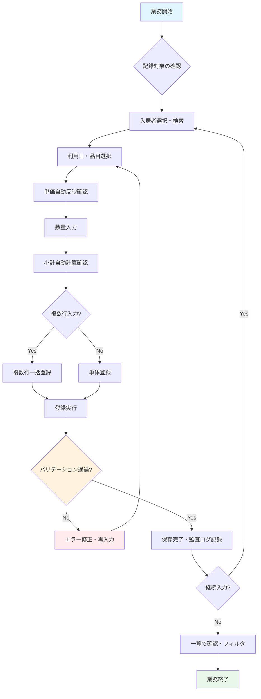

# 日次自費記録・管理業務フロー

## 概要
高齢者施設における入居者の日々の自費サービス利用（おむつ・理美容・日用品等）を記録し、請求計算の基礎データを作成する業務フロー。

---

## 業務フロー図



---

## 詳細ステップ

### Step 1: 記録対象の確認・絞り込み
| 項目 | 内容 |
|------|------|
| **操作画面** | 日次利用料一覧 (`DailyChargeResource::Pages\ListDailyCharges`) |
| **フィルタ機能** | 月別フィルタ、入居者フィルタ、施設フィルタ（施設管理者は自施設のみ） |
| **確認ポイント** | 対象月が正しいか、未入力日がないか、入居者ステータスが「入居中」か |

**操作手順:**
1. 管理画面「日々の自費」メニューを開く
2. 画面上部のフィルタバーから「請求月」を選択（デフォルト: 当月）
3. 必要に応じて「入居者」で絞り込み
4. 既存レコードの有無・入力漏れを確認

### Step 2: 入居者選択・検索
| 項目 | 内容 |
|------|------|
| **操作** | 「新規作成」ボタン → 入居者セレクトボックスから選択 |
| **検索機能** | 部屋番号、氏名（かな含む）でインクリメンタル検索可能 |
| **表示情報** | `[部屋番号] 氏名` 形式で表示（`Resident::getFullTitleAttribute()`） |
| **制御** | 施設管理者は所属施設の入居者のみ表示（`scopeForFacility`） |

**注意点:**
- ステータス「退去済」の入居者も選択可能だが、利用日バリデーションで弾かれる
- 入居日・退去日が設定されていない場合は期間チェックなし

### Step 3: 利用日・品目選択
| 項目 | 内容 |
|------|------|
| **利用日** | DatePicker で選択（過去・未来日付ともに入力可） |
| **品目選択** | `ChargeItem` マスタから選択（施設紐付けあり） |
| **自動反映** | 品目選択時に `unit_price` が自動セット（`ChargeItem::getPriceForDate()`） |

**価格決定ロジック (`DailyCharge::booted()`):**
```php
// charge_item_id 指定あり + unit_price 未設定/0 の場合
$charge->unit_price = $chargeItem->getPriceForDate($charge->date) ?? 0;
```
- `ChargeItemPrice` の適用期間（`effective_from` 〜 `effective_to`）を参照
- 該当期間の価格がない場合は 0 円（手動入力必須）

### Step 4: 数量入力・小計自動計算
| 項目 | 内容 |
|------|------|
| **数量** | 整数入力（1以上） |
| **小計計算** | `unit_price × quantity` をリアルタイム表示（`DailyCharge::getSubtotalAttribute()`） |
| **税区分** | 品目マスタの `tax_type`（課税/非課税）を参照し、税額も自動計算 |

**画面UI:**
- Filament の `Repeater` または複数行フォームで一括入力対応
- 数量変更時に JavaScript で小計・税額を即時再計算

### Step 5: バリデーション・保存
| バリデーション項目 | ルール | エラーメッセージ例 |
|------------------|--------|-------------------|
| 入居者 | 必須・存在チェック | 「入居者を選択してください」 |
| 利用日 | 必須・日付形式 | 「正しい日付を入力してください」 |
| 品目 | 必須・存在チェック | 「品目を選択してください」 |
| 単価 | 必須・0以上の整数 | 「単価を入力してください」 |
| 数量 | 必須・1以上の整数 | 「数量は1以上で入力してください」 |
| **在籍期間チェック** | 利用日が入居日〜退去日の範囲内 | 「利用日 (2026/10/15) が入居者の在籍期間外です。(入居日: 2026/10/01 〜 退去日: 2026/10/10)」 |

**在籍期間チェック実装 (`DailyCharge::booted()`):**
```php
if ($resident && ! $resident->isLivingAt($charge->date)) {
    throw new DomainException(
        "利用日 ({$charge->date->format('Y/m/d')}) が入居者の在籍期間外です。"
    );
}
```

### Step 6: 登録完了・監査ログ
| 項目 | 内容 |
|------|------|
| **保存処理** | `DailyCharge` モデル作成、トランザクション内でコミット |
| **自動補完** | `facility_id` が未設定の場合、入居者から自動設定 |
| **監査ログ** | `spatie/laravel-activitylog` で作成イベント記録（`log_name: daily_charge`） |
| **ログ内容** | resident_id, facility_id, charge_item_id, date, unit_price, quantity |
| **完了通知** | Filament トースト通知「作成しました」 |

### Step 7: 一覧確認・フィルタリング
| 機能 | 説明 |
|------|------|
| **一覧表示** | 日付、入居者、品目、数量、単価、小計、税額をテーブル表示 |
| **月別集計** | フィルタバーの月セレクタで対象月を切替 |
| **入居者別集計** | 特定入居者の月間利用額を確認 |
| **CSV出力** | 一覧画面のアクションから月次CSVエクスポート可能 |

---

## 入力画面イメージ

### 単体作成フォーム
```
┌─────────────────────────────────────────────────────┐
│  日々の自費記録 作成                                  │
├─────────────────────────────────────────────────────┤
│  入居者          ▼ [101] 佐藤 一郎                   │
│  利用日          [2026-10-15]  (カレンダー選択)       │
│  品目            ▼ [紙おむつ(パンツタイプ)]           │
│  単価            [180] ← 品目選択で自動反映          │
│  数量            [3]                                 │
│  小計            [540] ← 自動計算（読み取り専用）     │
│  税区分          [課税10%] ← 品目マスタから自動表示   │
│  税額            [54]  ← 自動計算                     │
│                                                     │
│  [キャンセル]                    [保存]             │
└─────────────────────────────────────────────────────┘
```

### 複数行一括登録（Repeater）
```
┌─────────────────────────────────────────────────────┐
│  日々の自費記録 作成（複数行）                        │
├─────────────────────────────────────────────────────┤
│  入居者          ▼ [101] 佐藤 一郎                   │
│                                                     │
│  ┌─ 行1 ────────────────────────────────────────┐  │
│  │ 利用日 [2026-10-01] 品目 ▼[おむつ] 単価[180]   │  │
│  │ 数量[3] 小計[540] 税額[54]  [削除]             │  │
│  └──────────────────────────────────────────────┘  │
│  ┌─ 行2 ────────────────────────────────────────┐  │
│  │ 利用日 [2026-10-02] 品目 ▼[おむつ] 単価[180]   │  │
│  │ 数量[2] 小計[360] 税額[36]  [削除]             │  │
│  └──────────────────────────────────────────────┘  │
│  [+ 行追加]                                         │
│                                                     │
│  [キャンセル]                    [一括保存]         │
└─────────────────────────────────────────────────────┘
```

---

## 業務ルール・制約事項

### 1. 価格決定優先順位
1. 手動入力された `unit_price`（最優先）
2. `ChargeItemPrice` の期間一致価格（日付ベース）
3. `ChargeItem` のデフォルト `unit_price`
4. 0円（手動入力必須）

### 2. 税区分・税率の適用
- 品目マスタ (`ChargeItem::tax_type`) で「課税」「非課税」を定義
- 請求月時点の有効税率 (`TaxSetting`) を適用
- `tax_breakdown` で標準税率(10%)・軽減税率(8%)を別管理（v1.3以降）

### 3. 在籍期間外入力の扱い
- **原則禁止**: `DomainException` で弾く
- **例外**: 退去日未設定（`null`）の場合は将来日付も許可
- **修正運用**: 確定済請求書（`Billed`/`Paid`）に影響する過去分は強制更新オプションで対応

### 4. 施設分離（マルチテナント）
- `facility_id` は入居者から自動取得・設定
- 施設管理者は `scopeForFacility` で自施設データのみ参照・操作可能
- 法人管理者（`is_admin=true`）は全施設横断で操作可能

---

## 関連するモデル・サービス

| クラス | 役割 |
|--------|------|
| `DailyCharge` | 日次利用料レコード（メインモデル） |
| `ChargeItem` | 請求品目マスタ（単価・税区分・施設紐付け） |
| `ChargeItemPrice` | 品目別価格履歴（期間管理） |
| `Resident` | 入居者（在籍期間判定・施設紐付け） |
| `DailyChargeResource` | Filament リソース（一覧・作成・編集） |
| `InvoiceCalculationService` | 月次請求生成時に集計対象となる |

---

## 運用上のベストプラクティス

### 毎日実施推奨
- **入力漏れ防止**: 当日分の記録を当日中に入力
- **ダッシュボード活用**: 未入力アラート（将来実装予定）で漏れを検知

### 月末締め前
- **全入居者分チェック**: フィルタで対象月全件表示し、件数・金額を目視確認
- **異常値検知**: 前月比・単価変動の大きいレコードを確認（将来実装予定）

### 修正・削除
- **未請求（Unbilled）**: 自由に編集・削除可能
- **請求済（Billed）以降**: 原則編集不可。`force_update` オプションで管理者のみ強制更新可
- **監査ログ**: 全操作が `activity_log` に記録されるため、後から追跡可能

---

## トラブルシューティング

| 症状 | 原因 | 対処 |
|------|------|------|
| 単価が自動反映されない | `ChargeItemPrice` に該当期間のレコードがない | 価格履歴を登録、または手動入力 |
| 「在籍期間外」エラー | 入居日・退去日と利用日が矛盾 | 入居者の在籍期間を確認・修正、または利用日を修正 |
| 施設管理者で他施設の入居者が見える | `facility_id` が正しく設定されていない | 入居者の `facility_id` を修正、またはデータ移行時に確認 |
| 税額が合わない | `TaxSetting` の適用期間が請求月とズレている | 税率設定の期間を見直し、請求月をカバーするレコードを作成 |

---

## 今後の拡張予定（改善提案より）

| 改善項目 | 期待効果 | 実装目安 |
|----------|----------|----------|
| 入力漏れ検知アラート | 請求漏れ防止・後修正削減 | 短期（1-2ヶ月） |
| スマホ最適化UI | 現場職員の入力効率向上 | 短期 |
| 定型パターン登録（テンプレート） | 定期利用品目の高速入力 | 中期 |
| 写真添付（利用実績エビデンス） | 監査対応・トラブル防止 | 中期 |

---

## 参照ドキュメント
- [操作マニュアル 第4章 日々の自費記録](docs/操作マニュアル.md#第4章-日々の自費記録)
- [README.md デモシナリオ Step 1](README.md#step-1日々の自費記録を入力する毎日)
- `app/Filament/Resources/DailyChargeResource.php`
- `app/Models/DailyCharge.php`
- `app/Models/ChargeItem.php`
- `app/Models/ChargeItemPrice.php`