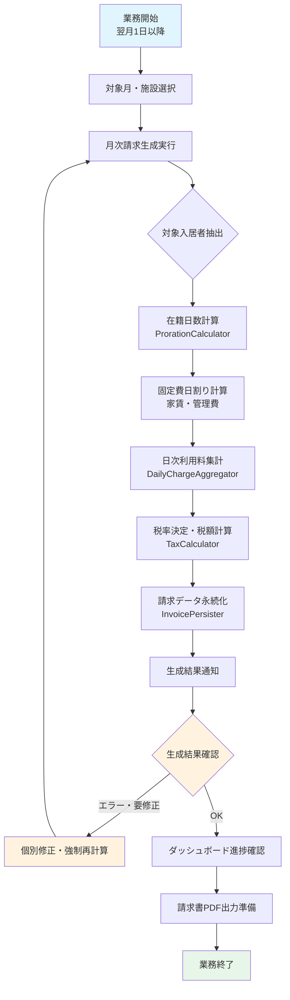

# 月次請求書生成・発行業務フロー

## 概要
翌月1日以降に、前月分の日次利用料・固定費（家賃・管理費）を集計し、日割り計算・税計算を経て月次請求書データを一括生成・確定する業務フロー。

---

## 業務フロー図



---

## 詳細ステップ

### Step 1: 対象月・施設の選択
| 項目 | 内容 |
|------|------|
| **操作画面** | 月次請求書一覧 (`MonthlyInvoiceResource::Pages\ListMonthlyInvoices`) |
| **トリガー** | 「🧮 {年月}の請求データを一括生成する」アクションボタン |
| **パラメータ** | 請求年月（`YYYY-MM`）、施設（複数施設時） |
| **デフォルト** | 当月（システム日付ベース） |

**操作手順:**
1. 管理画面「月次請求書」メニューを開く
2. 画面上部のアクションバーから「🧮 2026-10の請求データを一括生成する」をクリック
3. モーダルで対象月・施設を確認・選択
4. 「実行」ボタンで生成開始

### Step 2: 対象入居者の抽出ロジック
`InvoiceCalculationService::getTargetResidents()` による抽出条件：

| 条件 | 判定ロジック | 備考 |
|------|-------------|------|
| **施設一致** | `facility_id` = 選択施設 | 施設管理者は自施設固定 |
| **在籍判定** | `Resident::isLivingAt(月初)` OR `isLivingAt(月末)` | 月初・月末のいずれかで在籍していれば対象 |
| **ステータス** | `Active` または `MovedOut`（退去済でも在籍期間があれば対象） | 予約中は除外 |
| **既存請求チェック** | 同年月・同入居者の `MonthlyInvoice` 有無 | 既存あり → ステータスによりスキップ/上書き |

**在籍日数計算 (`Resident::getLivingDaysInMonth()`):**
```php
// 例: 2026年10月（31日）に 10/1〜10/15 在籍の場合
$start = Carbon::create(2026, 10, 1);      // 月初
$end   = $start->copy()->endOfMonth();     // 10/31
$moveIn = Carbon::parse('2026-10-01');
$moveOut = Carbon::parse('2026-10-15');

$effectiveStart = max($start, $moveIn);    // 10/1
$effectiveEnd   = min($end, $moveOut);     // 10/15
$livingDays = $effectiveStart->diffInDays($effectiveEnd) + 1; // 15日
```

### Step 3: 固定費（家賃・管理費）の日割り計算
`ProrationCalculator` による計算：

| 項目 | 計算式 | 例（家賃¥65,000、管理費¥30,000、在籍15日/31日月） |
|------|--------|--------------------------------------------------|
| **家賃日割り** | `round(月額家賃 ÷ 月日数 × 在籍日数)` | `round(65,000 ÷ 31 × 15) = ¥31,452` |
| **管理費日割り** | `round(月額管理費 ÷ 月日数 × 在籍日数)` | `round(30,000 ÷ 31 × 15) = ¥14,516` |
| **非課税判定** | 家賃は非課税、管理費は課税（品目マスタ設定による） | `tax_breakdown` で別管理 |

**四捨五入ルール:**
- 単位: 1円単位（`round()` 関数使用）
- 端数処理: 四捨五入（銀行丸めではない）

### Step 4: 日次利用料（自費）の集計
`DailyChargeAggregator` による税区分別集計：

```php
// 集計ロジック（簡略版）
$dailyCharges = DailyCharge::forYearMonth($yearMonth)
    ->forFacility($facilityId)
    ->whereHas('resident', fn($q) => $q->where('id', $residentId))
    ->get();

$taxableTotal = 0;      // 課税対象額
$nonTaxableTotal = 0;   // 非課税対象額
$taxBreakdown = [       // v1.3: 税率別内訳
    'standard' => ['taxable_amount' => 0, 'tax_amount' => 0, 'tax_rate' => 10],
    'reduced'  => ['taxable_amount' => 0, 'tax_amount' => 0, 'tax_rate' => 8],
];

foreach ($dailyCharges as $charge) {
    $subtotal = $charge->subtotal; // unit_price * quantity
    if ($charge->chargeItem->tax_type === 'taxable') {
        $taxableTotal += $subtotal;
        // 税率別に振り分け（品目マスタの税率 or 請求月時点の税率設定）
        $taxBreakdown['standard']['taxable_amount'] += $subtotal;
    } else {
        $nonTaxableTotal += $subtotal;
    }
}
```

**集計結果の内訳例:**
| 区分 | 金額 | 税区分 | 備考 |
|------|------|--------|------|
| 基本家賃 | ¥31,452 | 非課税 | 日割り後 |
| 基本管理費 | ¥14,516 | 課税10% | 日割り後 |
| 自費サービス計 | ¥16,200 | 課税10% | 日次利用料集計 |
| **課税対象額計** | **¥30,716** | - | 管理費＋自費 |

### Step 5: 税率決定・税額計算
`TaxCalculator` による計算：

**税率決定ロジック:**
1. 請求年月（`YYYY-MM`）を基準日とする
2. `TaxSetting` から `effective_from <= 基準日 <= effective_to` のレコードを検索
3. 施設別設定優先、なければデフォルト（施設未指定）を適用
4. 見つからない場合は 10%（標準税率）をデフォルト

**税額計算（v1.3: 税率別内訳管理）:**
```php
// 標準税率（10%）分
$standardTaxable = $taxBreakdown['standard']['taxable_amount']; // ¥30,716
$standardTax = (int) round($standardTaxable * 0.10);            // ¥3,072

// 軽減税率（8%）分（該当品目がある場合）
$reducedTaxable = $taxBreakdown['reduced']['taxable_amount'];   // ¥0
$reducedTax = (int) round($reducedTaxable * 0.08);              // ¥0

// 合計税額
$totalTax = $standardTax + $reducedTax; // ¥3,072
```

**計算結果例:**
| 項目 | 金額 |
|------|------|
| 非課税額（家賃） | ¥31,452 |
| 課税対象額（管理費＋自費） | ¥30,716 |
| 消費税額（10%） | ¥3,072 |
| **税込合計額** | **¥65,240** |

### Step 6: 請求データ永続化
`InvoicePersister` によるチャンク処理（メモリ効率化）：

```php
// チャンク単位でトランザクション実行
Resident::query()
    ->forFacility($facilityId)
    ->targetForBilling($yearMonth)
    ->chunkById(100, function ($residents) use ($yearMonth, $facilityId) {
        DB::transaction(function () use ($residents, $yearMonth, $facilityId) {
            foreach ($residents as $resident) {
                $invoice = MonthlyInvoice::updateOrCreate(
                    ['resident_id' => $resident->id, 'billing_year_month' => $yearMonth],
                    [
                        'facility_id' => $facilityId,
                        'rent_subtotal' => $calculatedRent,
                        'management_fee_subtotal' => $calculatedMgmt,
                        'service_subtotal' => $calculatedService,
                        'taxable_amount' => $taxableTotal,
                        'tax_amount' => $totalTax,
                        'tax_rate' => 10.00,
                        'tax_breakdown' => $taxBreakdown,
                        'status' => InvoiceStatus::Unbilled,
                        'version' => 0,
                    ]
                );
            }
        });
    });
```

**ステータス遷移ルール:**
| 既存ステータス | 新規生成時の挙動 |
|--------------|----------------|
| **なし（新規）** | `Unbilled` で作成 |
| **Unbilled** | 上書き更新（再計算）、`version` インクリメント |
| **Billed** | スキップ（確定保護）、オプション `--force` で上書き可 |
| **Paid** | スキップ（入金確定）、`--force` でも上書き不可 |

### Step 7: 生成結果通知
実行完了時にトースト通知で以下を表示：

```
【2026-10分】
新規作成: 22件
再計算更新: 3件
スキップ(確定済): 2件
エラー: 0件
合計請求額: ¥2,456,780
```

**アクティビティログ記録:**
- `event: monthly_invoice_generated`
- `batch_uuid`: 実行ごとの一意ID（同一バッチの追跡用）
- `properties`: 対象月、施設、件数、合計金額、実行ユーザー

### Step 8: ダッシュボード進捗確認
生成後、ダッシュボード（`Dashboard` ページ）で進捗確認：

| 表示項目 | 内容 |
|----------|------|
| **進捗バー** | `請求済 + 入金済` ÷ `対象総数` × 100% |
| **件数サマリー** | 対象 / 請求済 / 未請求 / 入金済 の件数 |
| **未入金アラート** | `Billed` かつ `paid_at` が過去期限超過の件数 |
| **クイック統計** | 総請求額、総入金額、未回収額 |

**施設管理者の場合:** 自施設データのみ表示
**法人管理者の場合:** 全施設合算または施設切替で個別確認

### Step 9: 請求書PDF出力準備
生成完了後、以下のアクションが可能：
- **個別PDF**: 一覧の「📥 請求書PDF」ボタン
- **一括ZIP**: 「📦 一括PDF(ZIP)出力」ボタン（全入居者分をZIPでダウンロード）

---

## 計算ロジック詳細仕様

### 日割り計算の境界条件
| パターン | 在籍日数 | 計算式 | 備考 |
|----------|----------|--------|------|
| **月初入居・月末退去** | 月日数（満月） | `月額 × 1` | 日割り不要（満額） |
| **月中入居** | 入居日〜月末 | `月額 ÷ 月日数 × 在籍日数` | 入居日含む |
| **月中退去** | 月初〜退去日 | `月額 ÷ 月日数 × 在籍日数` | 退去日含む |
| **月またぎ入居・退去** | 入居日〜退去日 | 同上 | 短期滞在対応 |
| **入居日=退去日** | 1日 | `月額 ÷ 月日数 × 1` | 日帰り・短時間利用 |

### 税計算の特殊ケース
| ケース | 処理 |
|--------|------|
| **税率改定月** | 請求月基準で単一税率適用（月中改定は請求月全体で後日適用税率を使用） |
| **軽減税率品目混在** | `tax_breakdown` で標準/軽減を別集計、PDFで明細表示 |
| **税率設定なし** | 10%（標準税率）をデフォルト適用、警告ログ出力 |

### 楽観ロック（同時実行対策）
- `MonthlyInvoice::version` カラムで管理
- 更新時に `version` が変わっていた場合は `StaleObjectException` で失敗
- チャンク処理単位でトランザクション分離

---

## 自動実行スケジューラ（v1.5 新機能）

### コマンド: `billing:generate-monthly`
```bash
# 基本実行（前月分を自動生成）
php artisan billing:generate-monthly

# オプション指定
php artisan billing:generate-monthly --year-month=2026-10 --facility-id=1 --force --dry-run
```

| オプション | 説明 |
|------------|------|
| `--year-month` | 対象年月指定（デフォルト: 前月） |
| `--facility-id` | 施設限定（デフォルト: 全施設） |
| `--force` | `Billed` ステータスも強制再計算 |
| `--dry-run` | 実行せず件数・金額のみ試算表示 |

### スケジューラ登録 (`routes/console.php`)
```php
Schedule::command('billing:generate-monthly')
    ->monthlyOn(1, '02:00')  // 毎月1日 02:00
    ->environments(['production', 'staging'])  // 本番/ステージングのみ
    ->onSuccess(function () {
        Log::info('月次請求自動生成完了');
    })
    ->onFailure(function () {
        Log::error('月次請求自動生成失敗');
    });
```

---

## 操作画面イメージ

### 生成アクションモーダル
```
┌─────────────────────────────────────────────────────┐
│  🧮 2026年10月分の請求データを一括生成                │
├─────────────────────────────────────────────────────┤
│  対象施設: ケアレジデンス ひまわり                    │
│  対象月:   2026-10                                    │
│  対象入居者数(推定): 25名                             │
│                                                     │
│  ☐ 確定済み(Billed)も強制再計算する (--force)        │
│  ☐ 実行せず試算のみ行う (--dry-run)                   │
│                                                     │
│  [キャンセル]              [実行]                    │
└─────────────────────────────────────────────────────┘
```

### 生成結果トースト通知
```
┌─────────────────────────────────────────────────────┐
│  ✅ 月次請求データ生成完了                            │
├─────────────────────────────────────────────────────┤
│  対象月: 2026-10                                      │
│  新規作成: 22件                                       │
│  再計算更新: 3件                                      │
│  スキップ(確定済): 2件                                │
│  合計請求額: ¥2,456,780                               │
│  実行時間: 3.2秒                                      │
│                                                     │
│  [詳細を見る]                                         │
└─────────────────────────────────────────────────────┘
```

---

## 業務ルール・制約事項

### 1. 生成タイミング
- **推奨**: 翌月1日〜3営業日以内
- **締切**: 入金消込・会計連携の前提となるため遅延不可
- **自動化**: v1.5より毎月1日 02:00 自動実行（本番/ステージングのみ）

### 2. 再生成・修正ルール
| 状況 | 対応 |
|------|------|
| **日次利用料修正後** | 同月再生成（`--force` 不要、Unbilledなら上書き） |
| **入居者情報修正後** | 該当入居者のみ再生成（一覧から個別「再計算」アクション） |
| **税率設定修正後** | 全件再生成推奨（`--force` 必要） |
| **確定済(Billed)修正** | 管理者のみ `--force` で強制更新可、監査ログに記録 |

### 3. 確定保護（編集不可ルール）
| ステータス | 編集可否 | 削除可否 | 解除方法 |
|-----------|---------|---------|---------|
| **Unbilled** | ✅ 可 | ✅ 可 | - |
| **Billed** | ❌ 不可 | ❌ 不可 | 管理者が「下書き戻し」アクション実行 |
| **Paid** | ❌ 不可 | ❌ 不可 | 入金消込取消（会計連携後は原則不可） |

### 4. 請求書日付モード（v1.3 新機能）
| モード | 設定値 | 請求書日付 | 用途 |
|--------|--------|-----------|------|
| **自動** | `auto` | 生成実行日（または月末日） | 通常運用 |
| **任意指定** | `custom` | `custom_invoice_date` | 遡及請求・修正再発行 |

---

## 関連するモデル・サービス・コマンド

| クラス/コマンド | 役割 |
|----------------|------|
| `InvoiceCalculationService` | オーケストレーション（全体制御） |
| `ProrationCalculator` | 日割り計算専用 |
| `DailyChargeAggregator` | 日次利用料集計専用 |
| `RecurringChargeAggregator` | 定期課金集計専用（家賃・管理費等） |
| `TaxCalculator` | 税率決定・税額計算専用 |
| `InvoicePersister` | 永続化・チャンク処理専用 |
| `MonthlyInvoice` | 月次請求データモデル |
| `billing:generate-monthly` | 自動生成コマンド |
| `GenerateMonthlyInvoices` | ジョブクラス（キュー対応） |

---

## 運用上のベストプラクティス

### 実行前チェックリスト
- [ ] 前月分の日次利用料入力完了（未入力アラート確認）
- [ ] 入居者マスタの入居日・退去日確認
- [ ] 税率設定（`TaxSetting`）が対象月をカバーしているか
- [ ] 施設設定（インボイス番号・銀行口座）が正しいか

### 実行後確認項目
- [ ] 生成件数 = 対象入居者数 と一致
- [ ] 合計請求額が前月比で大きく乖離していないか（異常値検知）
- [ ] スキップ件数が意図したものか（確定済みの再計算漏れがないか）
- [ ] ダッシュボード進捗が正しく反映されているか

### トラブル時の切り戻し
1. **全件削除して再生成**: `MonthlyInvoice::where('billing_year_month', $ym)->delete()` 後再実行
2. **特定入居者のみ**: 該当レコード削除後、個別「再計算」実行
3. **強制上書きが必要**: `--force` オプション付きで再実行（Billedも上書き）

---

## トラブルシューティング

| 症状 | 原因 | 対処 |
|------|------|------|
| 件数が少ない | 対象入居者抽出条件に漏れ | `isLivingAt` 判定ロジック・入居日退去日を確認 |
| 税額が合わない | `TaxSetting` 期間不足・税率誤設定 | 税率設定の適用期間を見直し |
| 日割り額がおかしい | `daysInMonth` 計算誤り | `Carbon::create($year, $month)->daysInMonth` で確認 |
| 生成に時間がかかる | 入居者数多・チャンクサイズ不適 | `chunkById(100)` を調整、インデックス確認 |
| `--force` でも更新されない | `Paid` ステータスは `--force` でも保護 | 入金消込取消後、再度実行 |

---

## 今後の拡張予定（改善提案より）

| 改善項目 | 期待効果 | 実装目安 |
|----------|----------|----------|
| 請求承認ワークフロー | 内部統制・二重チェック体制 | 即時（Critical） |
| 異常値検知（前月比・平均乖離） | 請求ミス早期発見 | 短期（2-3週間） |
| 請求締めリマインド通知 | 実行忘れ防止 | 短期 |
| 複数施設一括生成の並列化 | 大規模法人の処理時間短縮 | 中期 |

---

## 参照ドキュメント
- [README.md デモシナリオ Step 2-3](README.md#step-2月次請求データを一括生成する翌月1日以降)
- [AUDIT_REPORT.md テーマ1 請求締め自動化](AUDIT_REPORT.md)
- `app/Services/InvoiceCalculationService.php`
- `app/Services/Invoice/ProrationCalculator.php`
- `app/Services/Invoice/DailyChargeAggregator.php`
- `app/Services/Invoice/TaxCalculator.php`
- `app/Services/Invoice/InvoicePersister.php`
- `app/Console/Commands/GenerateMonthlyInvoices.php`
- `routes/console.php`（スケジューラ登録）