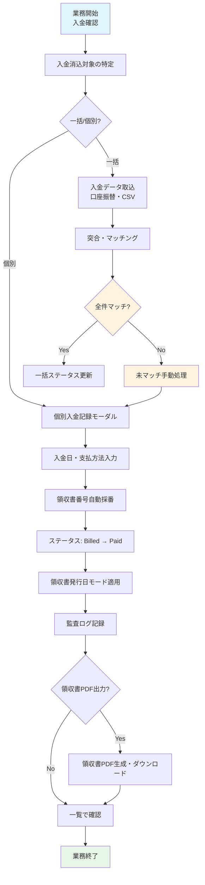
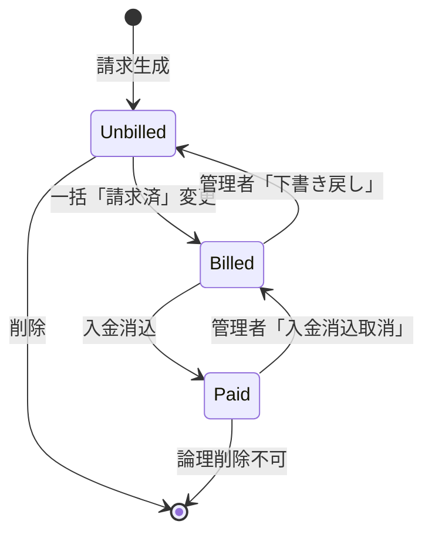

# 入金消込・領収書発行業務フロー

## 概要
請求書発行後、入金確認に基づきステータスを「請求済」→「入金済」へ遷移させ、領収書番号を自動採番・領収書PDFを発行する業務フロー。

---

## 業務フロー図



---

## 詳細ステップ

### Step 1: 入金消込対象の特定
| 項目 | 内容 |
|------|------|
| **操作画面** | 月次請求書一覧 (`MonthlyInvoiceResource::Pages\ListMonthlyInvoices`) |
| **フィルタ** | ステータス「請求済(Billed)」、請求月、施設、入居者 |
| **未入金アラート** | ダッシュボードの「未入金アラート」から未入金者を特定可能 |
| **期限管理** | 支払期限（`FACILITY_TRANSFER_DUE_DAYS`、デフォルト月末）超過でアラート表示 |

**操作手順:**
1. 管理画面「月次請求書」を開く
2. ステータスフィルタで「請求済」を選択
3. 対象月・施設で絞り込み
4. 未入金の入居者を確認（ダッシュボード連携）

### Step 2: 入金消込方式の選択
| 方式 | 適用場面 | 手順 |
|------|----------|------|
| **個別入力** | 現金・窓口入金、少数件数 | 一覧の「✅ 入金消込」アクション |
| **一括口座振替** | 月次口座振替データ取込 | CSV取込機能（将来実装予定・現状は個別繰返し） |
| **一括ステータス変更** | 入金済みリストを手持ちで確認済み | チェックボックス選択 → 「一括『入金済』に変更」 |

### Step 3: 個別入金記録モーダル
一覧の「✅ 入金消込」ボタン押下で表示：

```
┌─────────────────────────────────────────────────────┐
│  入金消込: [101] 佐藤 一郎様 (2026-10分)              │
├─────────────────────────────────────────────────────┤
│  請求額(税込): ¥115,820                             │
│  ─────────────────────────────────────────────────  │
│  入金日        [2026-11-15]  (カレンダー、デフォルト今日)│
│  支払方法      ▼ [銀行振込]                          │
│                 ├ 現金                               │
│                 ├ 銀行振込                           │
│                 ├ 口座振替                           │
│                 └ その他                             │
│  領収書日付    ▼ [自動]                              │
│                 ├ 自動 (入金日)                      │
│                 └ 任意指定 [2026-11-15]              │
│  備考          [11月分家賃等]                        │
│                                                     │
│  [キャンセル]              [入金消込実行]             │
└─────────────────────────────────────────────────────┘
```

| 項目 | 入力規則 | デフォルト |
|------|----------|------------|
| **入金日** | 必須・日付・未来日不可 | 今日 |
| **支払方法** | 必須・Enum選択 | - |
| **領収書日付モード** | `auto` / `custom` | `auto` |
| **任意領収書日付** | `custom` 時のみ必須 | - |
| **備考** | 任意・255文字以内 | - |

### Step 4: 領収書番号自動採番
`MonthlyInvoice::markAsPaid()` による採番ロジック：

```php
public function markAsPaid(PaymentMethod $method, ?string $paidAt = null, ...): void
{
    $this->update([
        'status' => InvoiceStatus::Paid,
        'paid_at' => $paidDate,
        'payment_method' => $method,
        // 領収書番号: REC-{YYYYMM}-{住居者ID4桁}
        'receipt_number' => $this->receipt_number 
            ?? sprintf('REC-%s-%04d', str_replace('-', '', $this->billing_year_month), $this->resident_id),
        'receipt_issued_at' => $this->receipt_issued_at ?? now(),
        'receipt_date_mode' => $receiptDateMode ?? 'auto',
        'custom_receipt_date' => $customReceiptDate,
    ]);
}
```

**採番ルール:**
| 要素 | 形式 | 例 |
|------|------|----|
| プレフィックス | `REC-` | 固定 |
| 請求年月 | `YYYYMM` (ハイフンなし) | `202610` |
| 連番 | 住居者ID 4桁ゼロパディング | `0001`〜`9999` |
| **完成形** | `REC-YYYYMM-NNNN` | `REC-202610-0001` |

**特徴:**
- 同一請求月・同一入居者で重複しない（住居者IDベース）
- 最大 9,999 件/月/施設まで対応
- 手動上書き可能（`receipt_number` 直接指定時は採番スキップ）
- 連番ギャップ検知機能（将来実装予定：改ざん検知）

### Step 5: ステータス遷移・確定保護
| 遷移 | 条件 | 制御 |
|------|------|------|
| **Unbilled → Billed** | 「一括『請求済』に変更」アクション | 確認モーダル表示 |
| **Billed → Paid** | 「入金消込」実行 | 入金日・支払方法必須 |
| **Paid → Billed** | 入金消込取消（管理者のみ） | 監査ログ記録、領収書番号保持 |

**確定保護ルール:**
- `Billed` 以降: 請求金額・明細編集不可
- `Paid` 以降: 入金日・支払方法・領収書番号編集不可
- 解除には管理者権限（`is_admin=true`）と明示的アクションが必要

### Step 6: 領収書日付モード適用（v1.3 新機能）
| モード | 設定値 | 領収書日付 | 用途 |
|--------|--------|-----------|------|
| **自動** | `auto` | 入金日（`paid_at`） | 通常運用 |
| **任意指定** | `custom` | `custom_receipt_date` | 遡及入金・日付調整 |

**領収書PDF出力時の日付決定:**
```php
// InvoicePdfService::getReceiptDate()
$date = match ($invoice->receipt_date_mode) {
    'custom' => $invoice->custom_receipt_date,
    default  => $invoice->paid_at, // auto
};
```

### Step 7: 監査ログ記録
`spatie/laravel-activitylog` による自動記録：

| イベント | log_name | 主なプロパティ |
|----------|----------|----------------|
| 入金消込 | `monthly_invoice` | `status: billed → paid`, `paid_at`, `payment_method`, `receipt_number`, `receipt_issued_at` |
| 領収書発行 | `monthly_invoice` | `receipt_downloaded: true`, `download_at` |

**バッチUUID:** 同一操作セッション（一括処理等）で共通の `batch_uuid` を付与

### Step 8: 領収書PDF生成・ダウンロード
`InvoicePdfService::generateReceiptPdf()` による生成：

**出力トリガー:**
- 一覧の「🧾 領収書PDF」ボタン（`Paid` ステータスのみ表示）
- 詳細画面の「領収書ダウンロード」ボタン

**領収書PDF構成:**
```
┌─────────────────────────────────────────────────────┐
│  領収書                                             │
│  領収書番号: REC-202610-0001                        │
│  ─────────────────────────────────────────────────  │
│  令和8年11月15日                                    │
│                                                     │
│  佐藤 一郎 様                                       │
│                                                     │
│  金    百十五万八千二百円也 (¥115,820)              │
│                                                     │
│  但書: 家賃等として                                 │
│                                                     │
│  ┌─────────────────────────────────────────────┐   │
│  │ 内訳                                         │   │
│  │  基本家賃（非課税）          ¥65,000         │   │
│  │  管理費（課税10%）           ¥30,000         │   │
│  │  自費サービス（課税10%）     ¥16,200         │   │
│  │  消費税額                    ¥4,620         │   │
│  └─────────────────────────────────────────────┘   │
│                                                     │
│  ─────────────────────────────────────────────────  │
│  発行者: ケアレジデンス ひまわり                    │
│  インボイス登録番号: T1234567890123                 │
│  ─────────────────────────────────────────────────  │
│  収入印紙欄 (5万円以上の場合)                        │
└─────────────────────────────────────────────────────┘
```

**技術仕様:**
- `dompdf` + Noto Sans JP フォント
- 印影（角印）対応: `Facility::seal_path` 画像埋め込み
- 収入印紙欄: 5万円以上で自動表示（印紙税法対応）
- 一時ディレクトリ `try/finally` で確実クリーンアップ

### Step 9: 一覧確認・次アクション
入金消込完了後、一覧画面で以下を確認：

| 表示変化 | 変更前 | 変更後 |
|----------|--------|--------|
| **ステータスバッジ** | 🔵 請求済 (info) | 🟢 入金済 (success) |
| **入金日** | - | 2026-11-15 表示 |
| **領収書番号** | - | REC-202610-0001 表示 |
| **アクション** | ✅ 入金消込 | 🧾 領収書PDF |
| **ダッシュボード** | 未入金アラート対象 | 入金済件数にカウント |

---

## ステータス遷移詳細仕様

### 状態遷移図


### 各ステータスの権限マトリクス
| アクション | Unbilled | Billed | Paid | 権限 |
|-----------|----------|--------|------|------|
| 金額編集 | ✅ | ❌ | ❌ | 施設管理者 |
| 明細編集 | ✅ | ❌ | ❌ | 施設管理者 |
| 請求済変更 | ✅ | - | - | 施設管理者 |
| 下書き戻し | - | ✅ | ❌ | 法人管理者のみ |
| 入金消込 | - | ✅ | - | 施設管理者 |
| 入金消込取消 | - | - | ✅ | 法人管理者のみ |
| 領収書PDF | - | - | ✅ | 施設管理者 |
| 請求書PDF | ✅ | ✅ | ✅ | 施設管理者 |
| 削除 | ✅ | ❌ | ❌ | 法人管理者のみ |

---

## 一括入金消込（将来拡張・現状は個別繰返し）

### 予定仕様: 口座振替データ取込・自動突合
```php
// 将来実装イメージ (テーマ2: 入金自動照合)
class BankTransferImporter
{
    public function import(ZenginFormat $file): ImportResult
    {
        // 1. 全銀フォーマット解析
        $records = $this->parseZengin($file);
        
        // 2. 突合キーでマッチング
        // キー: 入居者名カナ + 部屋番号 + 金額
        foreach ($records as $record) {
            $invoice = MonthlyInvoice::where('billing_year_month', $targetMonth)
                ->whereHas('resident', fn($q) => $q->where('name_kana', $record->kana))
                ->where('total_with_tax', $record->amount)
                ->where('status', InvoiceStatus::Billed)
                ->first();
            
            if ($invoice) {
                $invoice->markAsPaid(PaymentMethod::BankTransfer, $record->date);
                $matched++;
            } else {
                $unmatched[] = $record;
            }
        }
        
        return new ImportResult($matched, $unmatched);
    }
}
```

**突合精度向上策:**
- 照合キー複数化: 氏名カナ＋部屋番号＋請求額＋振込人名
- ファジー検索: かな表記ゆれ吸収（小文字・濁点・長音）
- 手動マッチング画面: 未マッチ分をUIで手動紐付け

---

## 関連するモデル・サービス・Enum

| クラス | 役割 |
|--------|------|
| `MonthlyInvoice` | 請求データ・ステータス管理・領収書番号採番 |
| `InvoiceStatus` | `Unbilled` / `Billed` / `Paid` Enum |
| `PaymentMethod` | `Cash` / `BankTransfer` / `DirectDebit` / `Other` Enum |
| `InvoicePdfService` | PDF生成（請求書・領収書・ZIP） |
| `MonthlyInvoiceResource` | Filament リソース（一覧・詳細・アクション） |

---

## 運用上のベストプラクティス

### 入金消込のタイミング
- **推奨**: 入金確認翌日中
- **締切**: 月次締め（翌月5営業日目安）までに完了
- **遅延対応**: ダッシュボード未入金アラートで督促対象を特定

### 入金消込チェックリスト
- [ ] 入金日が正しいか（通帳・入金通知書と突合）
- [ ] 支払方法が正しいか（振込・現金・口座振替の区別）
- [ ] 金額が請求額と一致するか（過不足ないか）
- [ ] 領収書番号が採番されているか
- [ ] 領収書PDFが正しく出力できるか

### 修正・取消手順
| ケース | 手順 | 権限 |
|--------|------|------|
| **入金日誤り** | 詳細画面で「入金消込取消」→ 再度入金消込 | 法人管理者 |
| **支払方法誤り** | 同上 | 法人管理者 |
| **二重消込** | 片方を取消 | 法人管理者 |
| **領収書再発行** | 詳細画面「領収書PDF」で再ダウンロード | 施設管理者 |

---

## トラブルシューティング

| 症状 | 原因 | 対処 |
|------|------|------|
| 領収書番号が採番されない | `markAsPaid()` 実行前に `update()` 直書き | 必ず `markAsPaid()` メソッド使用 |
| 領収書PDFが出力されない | ステータスが `Paid` ではない | ステータス確認、入金消込完了待ち |
| 収入印紙欄が出ない | 税込合計 5万円未満 | 仕様通り（5万円以上で表示） |
| 印影が表示されない | `Facility::seal_path` 未設定/パス誤り | 施設編集で印影画像アップロード・パス確認 |
| 領収書日付がズレる | `receipt_date_mode` / `custom_receipt_date` 設定誤り | モード確認、任意指定の場合は日付入力確認 |
| 入金消込取消できない | 権限不足（施設管理者） | 法人管理者（`is_admin=true`）に依頼 |

---

## 今後の拡張予定（改善提案より）

| 改善項目 | 期待効果 | 実装目安 |
|----------|----------|----------|
| 口座振替データ自動取込・照合 (テーマ2) | 照合工数90%削減・ミス防止 | 短期（1-2ヶ月） |
| 滞納自動検知・督促ワークフロー (テーマ3) | 督促漏れ防止・回収率向上 | 短期（1-2ヶ月） |
| 領収書番号連番管理・ギャップ検知・改ざん検知 | 税務調査対応・内部統制 | 短期（1週間） |
| 入金消込時の証憑添付必須化 | 内部統制・証憑管理 | 即時（Critical） |
| 支払期限リマインド自動通知 (メール・LINE) | 未入金削減 | 短期（2-3週間） |
| クレジットカード・コンビニ払い・スマホ決済連携 | 支払選択肢拡大・利用者利便性 | 長期（8-12週間） |

---

## 参照ドキュメント
- [README.md デモシナリオ Step 5-6](README.md#step-5一括請求済に変更する)
- [AUDIT_REPORT.md テーマ2・3](AUDIT_REPORT.md)
- `app/Models/MonthlyInvoice.php` (`markAsPaid` メソッド)
- `app/Enums/InvoiceStatus.php`
- `app/Enums/PaymentMethod.php`
- `app/Services/InvoicePdfService.php`
- `app/Filament/Resources/MonthlyInvoiceResource.php`