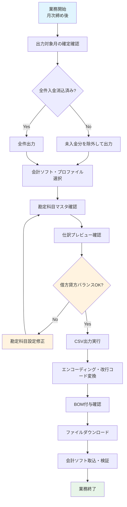

# 会計連携・CSV出力業務フロー

## 概要
確定済み請求データ（請求済・入金済）を会計ソフト（freee・マネーフォワード・弥生・勘定奉行）取込用の仕訳CSVとして出力し、経理業務と連携する業務フロー。

---

## 業務フロー図



---

## 詳細ステップ

### Step 1: 出力対象月の確定確認
| 項目 | 内容 |
|------|------|
| **前提条件** | 月次請求生成完了、入金消込が概ね完了 |
| **対象ステータス** | `Billed`（請求済）および `Paid`（入金済）のみ |
| **除外対象** | `Unbilled`（未請求）は会計仕訳から除外（未確定のため） |
| **確認画面** | 月次請求書一覧でステータス分布を確認 |

**操作手順:**
1. 管理画面「月次請求書」を開く
2. 対象月・施設でフィルタ
3. ステータス集計サマリーで「請求済」「入金済」件数を確認
4. 「未請求」が残っている場合は、請求確定漏れがないか確認

### Step 2: 会計ソフト・プロファイル選択
`AccountingExportProfile` による柔軟な出力フォーマット対応：

| 会計ソフト | プロファイル名 | 文字コード | 改行コード | BOM | ヘッダー行 |
|------------|---------------|-----------|-----------|-----|-----------|
| **freee** | `freee標準` | UTF-8 | LF | あり | あり |
| **マネーフォワード** | `MF標準` | UTF-8 | LF | あり | あり |
| **弥生会計** | `弥生標準` | CP932 (SJIS) | CRLF | なし | なし |
| **勘定奉行** | `奉行標準` | CP932 (SJIS) | CRLF | なし | あり |
| **カスタム** | ユーザー定義 | 選択可 | 選択可 | 選択可 | 選択可 |

**プロファイル設定項目 (`AccountingExportProfile`):**
```php
// 主な設定フィールド
'name' => 'freee標準',
'accounting_software' => 'freee',  // freee|moneyforward|yayoi|jobcan|custom
'encoding' => 'UTF-8',             // UTF-8|CP932|SJIS-win
'line_ending' => 'LF',             // LF|CRLF|CR
'bom' => true,                     // true|false
'has_header' => true,              // true|false
'field_mapping' => [               // フィールドマッピング (JSON)
    'date' => 'date',
    'debit_account_code' => 'debit_account_code',
    'debit_account_name' => 'debit_account_name',
    'credit_account_code' => 'credit_account_code',
    'credit_account_name' => 'credit_account_name',
    'amount' => 'amount',
    'tax_code' => 'tax_code',
    'description' => 'description',
],
'tax_code_mapping' => [            // 税区分コード変換 (JSON)
    'taxable_10' => '課税仕入10%',
    'taxable_8' => '軽減税率8%',
    'non_taxable' => '非課税',
    'tax_exempt' => '不課税',
],
```

### Step 3: 勘定科目マスタ確認
`ChartOfAccount` で施設別・品目別の勘定科目を管理：

| 品目区分 | 借方科目 (デフォルト) | 貸方科目 (デフォルト) | 補助科目 | 税区分 |
|----------|---------------------|---------------------|----------|--------|
| **家賃** | 1100: 売掛金 | 4110: 賃貸料収入 | 入居者名 | 非課税 |
| **管理費** | 1100: 売掛金 | 4120: 施設管理費収入 | 入居者名 | 課税10% |
| **自費サービス** | 1100: 売掛金 | 4130: 自費立替金収入 | 品目名 | 課税10% |
| **消費税** | 1100: 売掛金 | 2210: 仮受消費税 | - | - |

**設定画面:** `ChartOfAccountResource` で施設ごとに管理
- 施設別デフォルトは `FacilityBillingSeeder` で自動作成
- 補助科目・部門・タグ・税区分コード対応

### Step 4: 仕訳プレビュー確認
出力前に内容を確認するプレビュー機能：

```
┌─────────────────────────────────────────────────────────────────┐
│  会計仕訳CSV プレビュー (2026-10, freee標準)                     │
├─────────────────────────────────────────────────────────────────┤
│  対象: 25件 (請求済:20 入金済:5)  除外: 未請求3件                │
│  総計: 借方 ¥2,890,500 / 貸方 ¥2,890,500  ✅ バランスOK         │
├────────┬────────┬──────────┬────────┬──────────┬────────┬───────┤
│ 日付   │ 借方科目│ 借方名   │ 貸方科目│ 貸方名   │ 金額   │ 税区分│
├────────┼────────┼──────────┼────────┼──────────┼────────┼───────┤
│2026/11/30│ 1100  │ 売掛金   │ 4110   │ 賃貸料収入│ 65,000│ 非課税│
│2026/11/30│ 1100  │ 売掛金   │ 4120   │ 管理費収入│ 30,000│ 課税10%│
│2026/11/30│ 1100  │ 売掛金   │ 4130   │ 自費収入  │ 16,200│ 課税10%│
│2026/11/30│ 1100  │ 売掛金   │ 2210   │ 仮受消費税│ 4,620 │ -     │
│  ...   │  ...   │  ...     │  ...   │  ...     │  ...  │  ...  │
└────────┴────────┴──────────┴────────┴──────────┴────────┴───────┘
│                                                     [CSVダウンロード]│
└─────────────────────────────────────────────────────────────────┘
```

**プレビュー確認ポイント:**
- ✅ 借方合計 = 貸方合計（バランスチェック）
- ✅ 税区分コードが会計ソフト仕様と合致
- ✅ 補助科目（入居者名・品目名）が正しく設定
- ✅ 日付が会計ソフト期待形式（`YYYY/MM/DD` 等）

### Step 5: CSV出力実行
`InvoiceCsvExportService::exportAccountingCsv()` による生成：

**出力処理フロー:**
```php
public function exportAccountingCsv(
    string $yearMonth,
    int $facilityId,
    AccountingExportProfile $profile,
    bool $previewOnly = false
): ExportResult {
    // 1. 対象請求書取得 (Billed + Paid のみ)
    $invoices = MonthlyInvoice::forYearMonth($yearMonth)
        ->forFacility($facilityId)
        ->whereIn('status', [InvoiceStatus::Billed, InvoiceStatus::Paid])
        ->with(['resident', 'facility'])
        ->get();

    // 2. 仕訳行生成
    $journalLines = [];
    foreach ($invoices as $invoice) {
        $journalLines = array_merge($journalLines, 
            $this->buildJournalLines($invoice, $profile)
        );
    }

    // 3. バランスチェック
    $debitTotal = array_sum(array_column($journalLines, 'debit_amount'));
    $creditTotal = array_sum(array_column($journalLines, 'credit_amount'));
    if ($debitTotal !== $creditTotal) {
        throw new \Exception("仕訳バランス不一致: 借方{$debitTotal} ≠ 貸方{$creditTotal}");
    }

    // 4. CSV構築・エンコード変換
    $csv = $this->buildCsv($journalLines, $profile);
    
    // 5. エンコーディング変換
    $csv = $this->convertEncoding($csv, $profile->encoding);
    
    // 6. 改行コード変換
    $csv = $this->convertLineEnding($csv, $profile->line_ending);
    
    // 7. BOM付与
    if ($profile->bom && $profile->encoding === 'UTF-8') {
        $csv = "\xEF\xBB\xBF" . $csv;
    }

    return new ExportResult($csv, count($invoices), count($journalLines));
}
```

### Step 6: エンコーディング・改行コード変換・BOM付与
会計ソフト別の仕様差異を吸収：

| 処理 | 実装詳細 |
|------|----------|
| **文字コード変換** | `mb_convert_encoding($csv, $targetEncoding, 'UTF-8')` |
| **改行コード変換** | `str_replace("\n", $lineEnding, $csv)` |
| **BOM付与** | UTF-8且つ `$profile->bom` true の場合 `"\xEF\xBB\xBF" . $csv` |
| **ヘッダー行制御** | `$profile->has_header` false の場合ヘッダー行スキップ |

**変換例（弥生会計向け）:**
```
元データ (UTF-8, LF):
"日付","借方科目コード","借方科目名","貸方科目コード","貸方科目名","金額","税区分"
"2026/11/30","1100","売掛金","4110","賃貸料収入","65000","非課税"

変換後 (CP932, CRLF, BOMなし, ヘッダーなし):
2026/11/30,1100,売掛金,4110,賃貸料収入,65000,非課税
2026/11/30,1100,売掛金,4120,管理費収入,30000,課税仕入10%
```

### Step 7: 会計ソフト取込・検証
出力されたCSVを各会計ソフトに取り込み：

| 会計ソフト | 取込メニュー | 確認ポイント |
|------------|-------------|-------------|
| **freee** | 「取引の登録」→「ファイル取込」 | 取込件数、エラー行、残高確認 |
| **マネーフォワード** | 「仕訳インポート」 | インポート結果、勘定科目マッチング |
| **弥生会計** | 「ファイル」→「インポート」→「仕訳データ」 | 取込結果ログ、補助科目設定 |
| **勘定奉行** | 「データ変換」→「仕訳データ取込」 | 取込エラーチェック、部門集計 |

**よくある取込エラーと対処:**
| エラー | 原因 | 対処 |
|--------|------|------|
| 勘定科目コード不存在 | 会計ソフト側に科目未登録 | 会計ソフトで科目マスタ登録、またはコード修正 |
| 補助科目不一致 | 入居者名が補助科目にない | 会計ソフトで補助科目登録、または名称統一 |
| 税区分コード無効 | プロファイルの税区分マッピング誤り | `tax_code_mapping` 見直し |
| 金額桁数オーバー | 会計ソフトの金額上限超過 | 分割仕訳、または上限確認 |
| 日付形式不正 | 会計ソフト期待形式と異なる | プロファイルの日付フォーマット調整 |

---

## CSV出力形式詳細

### 月別リストCSV（管理用・横持ち）
用途: 施設内管理・請求一覧表・経営分析用

| カラム | 内容 | 例 |
|--------|------|----|
| 請求月 | YYYY-MM | 2026-10 |
| 入居者ID | 数値 | 1 |
| 部屋番号 | 文字列 | 101 |
| 入居者名 | 文字列 | 佐藤 一郎 |
| 基本家賃 | 整数 | 65000 |
| 基本管理費 | 整数 | 30000 |
| 自費計 | 整数 | 16200 |
| 課税対象額 | 整数 | 46200 |
| 消費税額 | 整数 | 4620 |
| 非課税額 | 整数 | 65000 |
| 税込合計 | 整数 | 115820 |
| ステータス | unbilled/billed/paid | billed |
| 入金日 | YYYY-MM-DD | 2026-11-15 |
| 支払方法 | cash/bank_transfer/... | bank_transfer |
| 領収書番号 | 文字列 | REC-202610-0001 |

### 会計仕訳CSV（複式簿記・縦持ち）
用途: 会計ソフト取込・経理処理

**freee形式例（ヘッダーあり）:**
```csv
"日付","借方科目コード","借方科目名","貸方科目コード","貸方科目名","金額","税区分","摘要","補助科目"
"2026/11/30","1100","売掛金","4110","賃貸料収入","65000","非課税","2026-10家賃","佐藤 一郎"
"2026/11/30","1100","売掛金","4120","施設管理費収入","30000","課税仕入10%","2026-10管理費","佐藤 一郎"
"2026/11/30","1100","売掛金","4130","自費立替金収入","16200","課税仕入10%","2026-10自費","佐藤 一郎"
"2026/11/30","1100","売掛金","2210","仮受消費税","4620","不課税","2026-10消費税",""
```

**弥生会計形式例（ヘッダーなし・CP932・CRLF）:**
```csv
2026/11/30,1100,売掛金,4110,賃貸料収入,65000,非課税,2026-10家賃,佐藤 一郎
2026/11/30,1100,売掛金,4120,施設管理費収入,30000,課税仕入10%,2026-10管理費,佐藤 一郎
2026/11/30,1100,売掛金,4130,自費立替金収入,16200,課税仕入10%,2026-10自費,佐藤 一郎
2026/11/30,1100,売掛金,2210,仮受消費税,4620,不課税,2026-10消費税,
```

---

## 仕訳生成ロジック詳細

### 1件の請求書から生成される仕訳行
```php
// MonthlyInvoice 1件 → 4〜5行の仕訳
// 入居者: 佐藤 一郎 (101号室)
// 家賃: 65,000 (非課税)
// 管理費: 30,000 (課税10%)
// 自費: 16,200 (課税10%)
// 消費税: 4,620

// 行1: 家賃
['debit_account' => '1100', 'debit_name' => '売掛金', 
 'credit_account' => '4110', 'credit_name' => '賃貸料収入',
 'amount' => 65000, 'tax_code' => '非課税', 'sub_account' => '佐藤 一郎']

// 行2: 管理費
['debit_account' => '1100', 'debit_name' => '売掛金',
 'credit_account' => '4120', 'credit_name' => '施設管理費収入',
 'amount' => 30000, 'tax_code' => '課税仕入10%', 'sub_account' => '佐藤 一郎']

// 行3: 自費
['debit_account' => '1100', 'debit_name' => '売掛金',
 'credit_account' => '4130', 'credit_name' => '自費立替金収入',
 'amount' => 16200, 'tax_code' => '課税仕入10%', 'sub_account' => '佐藤 一郎']

// 行4: 消費税 (税額内訳がある場合は標準/軽減で分割)
['debit_account' => '1100', 'debit_name' => '売掛金',
 'credit_account' => '2210', 'credit_name' => '仮受消費税',
 'amount' => 4620, 'tax_code' => '不課税', 'sub_account' => '']

// v1.3: tax_breakdown ありの場合
// 行4: 標準税率分
['amount' => 4620, 'tax_code' => '課税売上10%']
// 行5: 軽減税率分 (該当時)
['amount' => 0, 'tax_code' => '課税売上8%']
```

### 税区分マッピング（会計ソフト別）
| システム内区分 | freee | MF | 弥生 | 勘定奉行 |
|--------------|-------|-----|------|---------|
| **非課税** | 非課税 | 非課税 | 非課税 | 非課税 |
| **課税10%** | 課税仕入10% | 課税10% | 課税仕入10% | 消費税10% |
| **軽減8%** | 軽減税率8% | 軽減8% | 軽減税率8% | 消費税8% |
| **消費税額** | 不課税 | 不課税 | 不課税 | 不課税 |

---

## 関連するモデル・サービス・リソース

| クラス | 役割 |
|--------|------|
| `InvoiceCsvExportService` | CSV生成・エンコード変換・ダウンロード |
| `AccountingExportProfile` | 会計ソフト別出力プロファイル設定 |
| `ChartOfAccount` | 勘定科目マスタ（施設別・品目別） |
| `MonthlyInvoice` | 出力対象データ（Billed/Paidのみ） |
| `AccountingExportProfileResource` | プロファイル管理画面 |
| `ChartOfAccountResource` | 勘定科目管理画面 |
| `MonthlyInvoiceResource` | CSV出力アクション（プレビュー・ダウンロード） |

---

## 運用上のベストプラクティス

### 月次締めスケジュール例
| 日付 | 作業 | 担当 |
|------|------|------|
| **翌月1日** | 月次請求自動生成（スケジューラ） | システム自動 |
| **翌月2-3日** | 請求書PDF発行・送付 | 施設事務 |
| **翌月5-10日** | 入金消込・領収書発行 | 施設事務 |
| **翌月10-15日** | 未入金督促・再請求 | 施設管理者 |
| **翌月15-20日** | 会計CSV出力・取込 | 経理担当 |
| **翌月20-25日** | 会計ソフト側確認・決算準備 | 経理担当 |

### プロファイル管理のコツ
1. **初期設定**: `AccountingExportSeeder` で主要4ソフトのデフォルトプロファイル自動作成
2. **カスタマイズ**: 施設ごとの勘定科目コード体系に合わせて `field_mapping` 調整
3. **テスト取込**: 本番取込前にテスト環境で検証（プレビュー機能活用）
4. **バージョン管理**: プロファイル変更履歴を残す（監査ログ自動記録）

### トラブル防止チェックリスト
- [ ] `ChartOfAccount` で全品目の勘定科目が設定済みか
- [ ] 会計ソフトの科目コード・名称と完全一致しているか
- [ ] 税区分コードマッピングが会計ソフト仕様と合致しているか
- [ ] 文字コード・改行コード・BOMが会計ソフト要件を満たしているか
- [ ] 仕訳バランス（借方＝貸方）が取れているか（プレビューで確認）
- [ ] 除外対象（Unbilled）が含まれていないか

---

## トラブルシューティング

| 症状 | 原因 | 対処 |
|------|------|------|
| CSVが文字化けする | 文字コード不一致（UTF-8 vs CP932） | プロファイルの `encoding` 見直し、メモ帳で確認 |
| 改行が崩れる | 改行コード不一致（LF vs CRLF） | プロファイルの `line_ending` 見直し |
| 先頭に謎の文字 | BOM付与設定ミス | プロファイルの `bom` 設定確認 |
| 取込で勘定科目エラー | コード・名称不一致 | `ChartOfAccount` で会計ソフト側と完全一致させる |
| 補助科目が反映されない | 会計ソフト側で補助科目未登録 | 会計ソフトで補助科目登録、または名称統一 |
| 税区分エラー | `tax_code_mapping` 不備 | プロファイルの税区分マッピング見直し |
| 金額が合わない | Unbilled が混入 / 税計算差異 | フィルタ確認、プレビューでバランスチェック |
| ヘッダー行が邪魔 | 会計ソフトがヘッダー不要 | プロファイルの `has_header: false` |

---

## 今後の拡張予定（改善提案より）

| 改善項目 | 期待効果 | 実装目安 |
|----------|----------|----------|
| 電子帳簿保存法対応 (テーマ4) | タイムスタンプ・検索要件・JIIMA認証 | 中期（3-6ヶ月） |
| 入金消込自動照合 (テーマ2) | 口座振替データ自動突合・仕訳自動化 | 短期（1-2ヶ月） |
| APIファースト化・外部連携 (テーマ8) | 会計ソフトAPI直接連携・CSVレス | 中期（2-3ヶ月） |
| 仕訳テンプレート・ノーコードエディタ | 設定変更の内製化・属人化解消 | 中期 |
| 複数施設一括出力・法人統括CSV | 本部経理の一元処理・効率化 | 中期 |

---

## 参照ドキュメント
- [README.md デモシナリオ Step 7](README.md#step-7会計ソフトにcsvを出力する)
- [IMPROVEMENT_PROPOSALS.md テーマ4・8](IMPROVEMENT_PROPOSALS.md)
- `app/Services/InvoiceCsvExportService.php`
- `app/Models/AccountingExportProfile.php`
- `app/Models/ChartOfAccount.php`
- `app/Filament/Resources/AccountingExportProfileResource.php`
- `app/Filament/Resources/ChartOfAccountResource.php`
- `database/seeders/AccountingExportSeeder.php`
- `tests/Feature/InvoiceCsvExportServiceTest.php`
- `tests/Feature/InvoiceCsvExportServiceFilterTest.php`