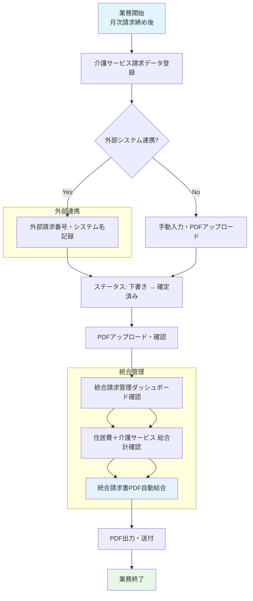

# 介護サービス請求管理業務フロー

## 概要
介護保険サービス（訪問介護・通所介護・居宅介護支援等）の請求データを管理し、住居費請求（家賃・管理費・自費）と統合した請求書PDFを自動結合・一元管理する業務フロー。v1.5 新機能。

---

## 業務フロー図



---

## 詳細ステップ

### Step 1: 介護サービス請求データ登録
| 項目 | 内容 |
|------|------|
| **操作画面** | 介護サービス請求一覧 (`ServiceInvoiceResource`) |
| **登録単位** | 入居者 × 請求年月 × サービス種別 |
| **サービス種別 (8種類)** | 訪問介護、通所介護、居宅介護支援、訪問看護、短期入所、福祉用具、住宅改修、その他 |
| **必須項目** | 施設、入居者、請求年月、サービス種別、金額、税額、税率 |

**入力フォーム例:**
```
┌─────────────────────────────────────────────────────┐
│  介護サービス請求 作成                                │
├─────────────────────────────────────────────────────┤
│  施設            ▼ [ケアレジデンス ひまわり]         │
│  入居者          ▼ [101] 佐藤 一郎                   │
│  請求年月        [2026-10]                           │
│  サービス種別    ▼ [訪問介護]                        │
│  金額(税抜)      [45,000]                            │
│  税額            [4,500]                             │
│  税率            [10.00]                             │
│  外部システム名  [ほのぼのケアシステム]              │
│  外部請求番号    [HC-202610-00123]                   │
│  PDFファイル     [ファイル選択] ← 任意アップロード    │
│  備考            [10月分訪問介護サービス]            │
│                                                     │
│  [キャンセル]              [下書き保存]               │
└─────────────────────────────────────────────────────┘
```

**ステータス初期値:** `Draft`（下書き）

### Step 2: 外部システム連携情報の記録
介護請求ソフト（ほのぼの、ケアプラン連携等）からのデータ取込時：

| 項目 | 用途 | 例 |
|------|------|----|
| **外部システム名** | 連携元システム識別 | `ほのぼのケアシステム`、`ケアマネジャー`、`自社システム` |
| **外部請求番号** | 突合キー・トレーサビリティ | `HC-202610-00123`、`KAIGO-202610-001` |
| **送信手段** | `sent_via` で記録 | `api`、`csv_import`、`manual`、`email` |

**API連携イメージ（将来拡張）:**
```php
// 外部システムからのコールバック想定
public function receiveExternalInvoice(ExternalInvoiceDto $dto): ServiceInvoice
{
    return ServiceInvoice::updateOrCreate(
        [
            'external_system_name' => $dto->systemName,
            'external_invoice_number' => $dto->invoiceNumber,
        ],
        [
            'facility_id' => $dto->facilityId,
            'resident_id' => $dto->residentId,
            'billing_year_month' => $dto->yearMonth,
            'service_type' => $dto->serviceType,
            'amount' => $dto->amount,
            'tax_amount' => $dto->taxAmount,
            'tax_rate' => $dto->taxRate,
            'status' => ServiceInvoiceStatus::Confirmed,
            'sent_at' => now(),
            'sent_via' => 'api',
        ]
    );
}
```

### Step 3: ステータス遷移・確定処理
| 遷移 | トリガー | 条件 | 権限 |
|------|----------|------|------|
| **Draft → Confirmed** | 「確定」アクション | 金額・税額入力済み | 施設管理者 |
| **Confirmed → Sent** | 「送信済み」アクション | PDF添付済み推奨 | 施設管理者 |
| **Sent → Confirmed** | 「下書き戻し」 | 訂正必要時 | 法人管理者 |
| **Confirmed → Draft** | 「下書き戻し」 | 入力ミス修正 | 施設管理者 |

**確定時のバリデーション:**
- 金額 > 0
- 税率は請求月時点の `TaxSetting` と整合（警告のみ）
- 同一入居者・同月・同一サービス種別の重複チェック（警告）

### Step 4: PDFアップロード・確認
外部システム発行の請求書PDFを添付：

| 項目 | 仕様 |
|------|------|
| **ファイル形式** | PDFのみ（`application/pdf`） |
| **上限サイズ** | 10MB / ファイル |
| **保存先** | `storage/app/service_invoices/{facility_id}/{year_month}/` |
| **ファイル名** | `{service_type}_{resident_id}_{timestamp}.pdf` |
| **元ファイル名保持** | `pdf_original_name` カラムに記録 |

**PDF有無による挙動差異:**
- **PDFあり**: 統合PDF結合時に「外部システム発行PDFは別添」として見出しページ挿入
- **PDFなし**: 見出しページのみ挿入（金額情報は本システムデータから表示）

### Step 5: 統合請求管理ダッシュボード確認
`IntegratedBillingDashboard` で住居費＋介護サービスを一元表示：

**画面構成:**
```
┌─────────────────────────────────────────────────────────────────────┐
│  統合請求管理ダッシュボード (2026-10, ケアレジデンス ひまわり)        │
├────────┬────────┬────────┬────────┬────────┬────────┬────────┬──────┤
│ 入居者 │ 家賃   │ 管理費  │ 自費    │ 住居費計 │ 介護計 │ 総合計 │状態  │
├────────┼────────┼────────┼────────┼────────┼────────┼────────┼──────┤
│ 101 佐藤│ 65,000│ 30,000│ 16,200 │ 115,820 │ 54,000 │ 169,820│●●○   │
│ 102 鈴木│ 65,000│ 30,000│  8,500 │ 106,150 │ 78,300 │ 184,450│●○○   │
│ 103 高橋│ 65,000│ 30,000│ 12,000 │ 110,800 │   -    │ 110,800│●○○   │
├────────┴────────┴────────┴────────┴────────┴────────┴────────┴──────┤
│  合計                                    332,770  132,300  465,070   │
└─────────────────────────────────────────────────────────────────────┘
凡例: ●=住居費請求済 ○=未請求  ●=介護請求済 ○=介護未請求/なし
```

**機能:**
- サービス種別ごとの金額列を動的生成（横スクロール対応）
- 住居費計 ＋ 介護計 ＝ 総合計 をリアルタイム集計
- 施設管理者は自施設のみ、法人管理者は全施設横断表示
- CSVエクスポート（BOM付きUTF-8）対応

### Step 6: 統合請求書PDF自動結合
`InvoiceMergeService` による住居費請求書＋介護サービス請求書の統合：

**結合構成:**
```
┌─────────────────────────────────────────────────────┐
│  1. 表紙（サマリー）                                 │
│     - 入居者・施設・請求月                            │
│     - 住居費内訳（家賃・管理費・自費・税額・小計）    │
│     - 介護サービス内訳（種別×金額・税額・小計）      │
│     - 総合計（住居費計＋介護計）                     │
├─────────────────────────────────────────────────────┤
│  2. 住居費請求書（既存MonthlyInvoice PDF）           │
│     - 明細内訳・日々の自費利用明細                   │
├─────────────────────────────────────────────────────┤
│  3. 介護サービス種別見出しページ（各種別毎）         │
│     - 「訪問介護 請求書」                            │
│     - 「（外部システム発行PDFは別添）」              │
│     - ※実PDFは外部システム発行分を別添運用         │
└─────────────────────────────────────────────────────┘
```

**生成トリガー:**
- 月次請求書詳細画面「📥 統合請求書PDF」
- 月次請求書一覧「📦 統合請求書一括ZIP」
- `InvoiceMergeService::generateAndSaveMergedInvoice()`

**技術仕様:**
- HTMLベース結合（dompdf で再レンダリング）
- ページ区切り（`page-break-before: always`）で明確に分離
- 統一ヘッダー・フッター・ページ番号（通し番号）
- Noto Sans JP フォント・印影対応

### Step 7: PDF出力・送付
| 出力方式 | 用途 | ファイル名形式 |
|----------|------|----------------|
| **個別統合PDF** | 入居者ごと送付 | `統合請求書_施設名_YYYYMM_入居者名.pdf` |
| **一括ZIP** | 施設一括送付・保管 | `統合請求書_施設名_YYYYMM.zip` |
| **介護サービス別PDF** | 外部システム連携用 | 別途 `ServiceInvoice` 単体で出力可能 |

---

## データモデル詳細

### ServiceInvoice モデル
```php
// 主なフィールド
'facility_id'           // 施設
'resident_id'           // 入居者
'billing_year_month'    // 請求年月 (YYYY-MM)
'service_type'          // ServiceType Enum (8種類)
'service_type_label'    // 表示用ラベル（将来カスタマイズ用）
'external_system_name'  // 外部システム名
'external_invoice_number' // 外部請求番号
'amount'                // 金額(税抜)
'tax_amount'            // 税額
'tax_rate'              // 税率
'pdf_path'              // PDFファイルパス (storage相対)
'pdf_original_name'     // 元ファイル名
'status'                // ServiceInvoiceStatus (Draft/Confirmed/Sent)
'sent_at'               // 送信日時
'sent_via'              // 送信手段
'notes'                 // 備考
```

### スコープ・クエリビルダ
```php
// よく使うクエリ
ServiceInvoice::forYearMonth('2026-10')           // 請求月絞込
    ->forFacility(1)                              // 施設絞込
    ->forResident(101)                            // 入居者絞込
    ->forServiceType('visiting_care')             // サービス種別絞込
    ->withStatus('confirmed')                     // ステータス絞込
    ->confirmed()                                 // 確定済みのみ
    ->sent()                                      // 送信済みのみ
    ->withPdf()                                   // PDFありのみ
```

### 税込合計アクセサ
```php
public function getTotalWithTaxAttribute(): int
{
    return $this->amount + $this->tax_amount;
}
```

---

## 統合請求管理の設計思想

### 住居費と介護サービスの分離・統合
| 観点 | 住居費 (MonthlyInvoice) | 介護サービス (ServiceInvoice) | 統合ビュー |
|------|------------------------|------------------------------|------------|
| **性質** | 家賃・管理費・自費（施設独自） | 介護保険給付対象サービス | 入居者総請求額 |
| **計算主体** | 本システムで自動計算 | 外部システム・手動入力 | ダッシュボード集計 |
| **PDF生成** | 本システムで生成 | 外部システム生成PDFを添付 | 自動結合 |
| **ステータス** | Unbilled/Billed/Paid | Draft/Confirmed/Sent | 統合進捗管理 |
| **会計連携** | 売上・消費税仕訳 | 介護保険収入仕訳 | 合算仕訳 |

### 介護保険請求との連携（将来拡張・テーマ6）
```
現状: 自費請求のみ（MonthlyInvoice + ServiceInvoice 手動管理）
将来: 介護保険請求連携
  ├ 国保連CSV突合（請求・支払通知）
  ├ 自費・保険の統合請求管理
  ├ 給付管理・過誤調整対応
  └ レセプト電算化システム連携
```

---

## 関連するモデル・サービス・リソース

| クラス | 役割 |
|--------|------|
| `ServiceInvoice` | 介護サービス請求データモデル |
| `ServiceType` | サービス種別Enum（8種類・表示順序付き） |
| `ServiceInvoiceStatus` | ステータスEnum（Draft/Confirmed/Sent） |
| `InvoiceMergeService` | PDF自動結合サービス |
| `IntegratedBillingDashboard` | 統合請求管理ダッシュボードページ |
| `ServiceInvoiceResource` | Filament リソース（CRUD・ステータス遷移・PDF） |
| `InvoicePdfService` | PDF生成基盤（統合PDF含む） |

---

## 運用上のベストプラクティス

### 月次運用スケジュール（介護サービス分）
| 時期 | 作業 | 担当 |
|------|------|------|
| **月末〜翌月5日** | 外部介護請求ソフトで請求確定・CSV出力 | 介護事務 |
| **翌月5-10日** | 本システムへCSV取込・手動登録・PDF添付 | 施設事務 |
| **翌月10-15日** | 確定処理（Draft→Confirmed） | 施設管理者 |
| **翌月15-20日** | 統合ダッシュボードで金額確認・差異チェック | 施設管理者・経理 |
| **翌月20-25日** | 統合請求書PDF生成・送付 | 施設事務 |
| **翌月25-月末** | 会計CSV出力（住居費＋介護合算） | 経理 |

### データ整合性チェックポイント
- [ ] 同一入居者・同月・同一サービス種別の重複なし
- [ ] 外部請求番号の重複なし（同一システム内）
- [ ] 金額・税額・税率の整合性（税額 ≈ 金額 × 税率）
- [ ] PDF添付漏れなし（Confirmed/Sent では必須推奨）
- [ ] 統合ダッシュボードの総合計 = 住居費計 ＋ 介護計

### 施設管理者・法人管理者の役割分担
| 作業 | 施設管理者 | 法人管理者 |
|------|-----------|-----------|
| データ登録・修正 | ✅ | ✅ |
| 確定（Draft→Confirmed） | ✅ | ✅ |
| 送信済みマーク | ✅ | ✅ |
| 下書き戻し（Sent→Confirmed） | ❌ | ✅ |
| PDF削除・差替 | ✅ | ✅ |
| 統合ダッシュボード閲覧 | 自施設のみ | 全施設横断 |
| 統合PDF生成 | ✅ | ✅ |

---

## トラブルシューティング

| 症状 | 原因 | 対処 |
|------|------|------|
| 統合PDFに介護サービスが反映されない | `ServiceInvoice` の `pdf_path` が null / ステータスが Draft | PDFアップロード、ステータスを Confirmed 以上に |
| 統合ダッシュボードに表示されない | 請求年月・施設ID不一致 | `billing_year_month` 形式確認、施設ID確認 |
| 介護サービス金額が合算されない | `status` が Draft のまま | Confirmed または Sent に更新 |
| PDF結合でエラー | 添付PDFが破損・パスワード保護 | PDF検証、パスワード解除、再アップロード |
| 外部請求番号重複エラー | 同一システム・同一番号で二重登録 | 重複チェック、外部システム側で番号管理 |
| 税率が合わない | 請求月と税率設定期間のズレ | `TaxSetting` 期間見直し、手動修正 |

---

## 今後の拡張予定（改善提案・ロードマップより）

| 改善項目 | 期待効果 | 実装目安 | 優先度 |
|----------|----------|----------|--------|
| **介護保険請求連携 (テーマ6)** | 国保連CSV突合・自費保険統合・レセプト電算化 | 長期（6ヶ月〜） | 🟢 Long-term |
| **外部システムAPI連携 (テーマ8)** | 介護請求ソフトとの自動データ連携・二重入力解消 | 中期（2-3ヶ月） | 🟡 Medium |
| **介護報酬改定自動追従** | 年1回改定への自動対応・マスタ更新効率化 | 中期 | 🟡 Medium |
| **サービス種別マスタ拡張** | 施設独自サービス種目追加・単価管理 | 短期 | 🟠 High |
| **統合請求書テンプレートカスタマイズ** | 施設ブランディング・見やすさ向上 | 短期 | 🟡 Medium |
| **介護サービス請求CSV出力** | 介護請求専用会計連携・分析用 | 短期 | 🟠 High |

---

## 参照ドキュメント
- [README.md v1.5 変更履歴](README.md#変更履歴-v15-2026-10-09)
- [IMPROVEMENT_PROPOSALS.md テーマ6・8](IMPROVEMENT_PROPOSALS.md)
- `app/Models/ServiceInvoice.php`
- `app/Enums/ServiceType.php`
- `app/Enums/ServiceInvoiceStatus.php`
- `app/Services/InvoiceMergeService.php`
- `app/Filament/Pages/IntegratedBillingDashboard.php`
- `app/Filament/Resources/ServiceInvoiceResource.php`
- `database/migrations/*_create_service_invoices_table.php`
- `tests/Feature/ServiceInvoice*Test.php`