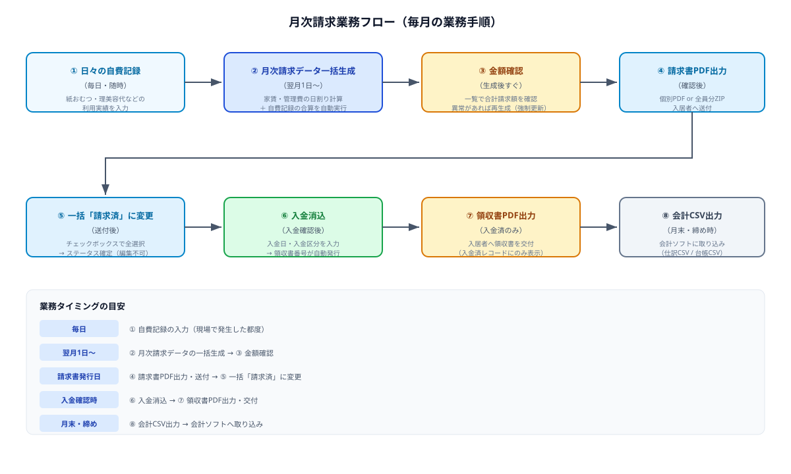
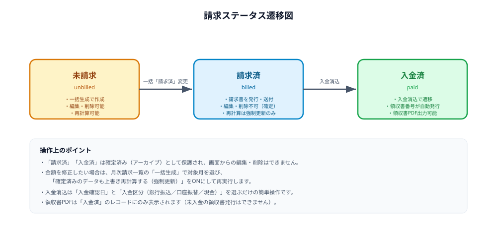
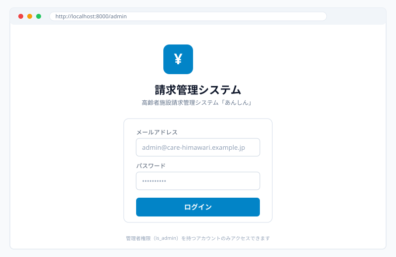
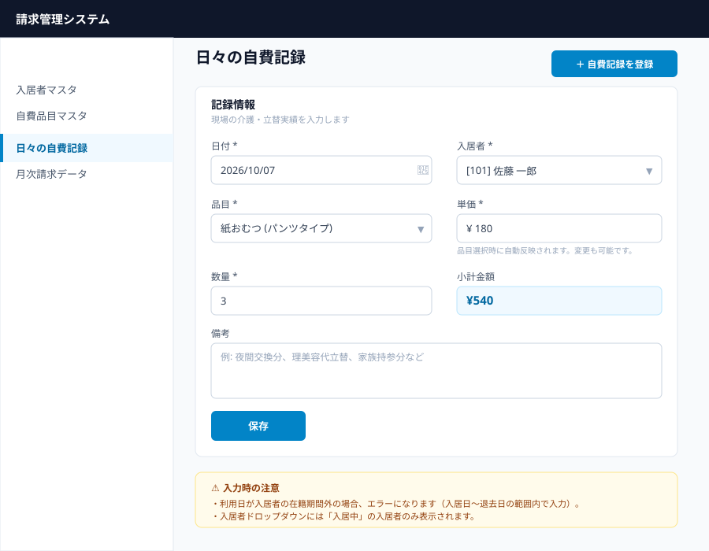
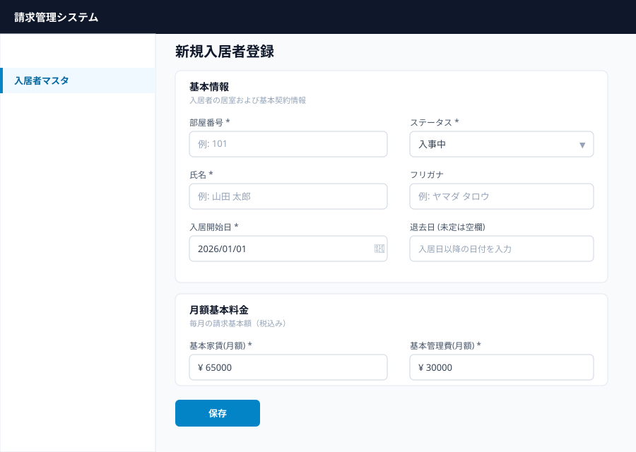
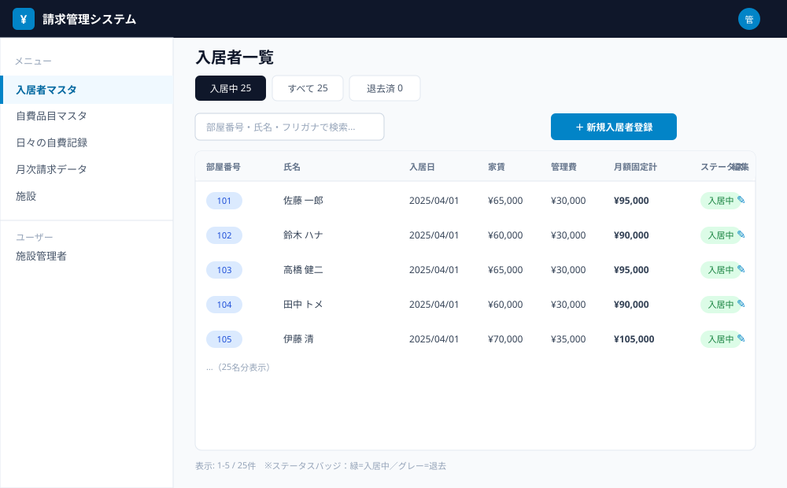
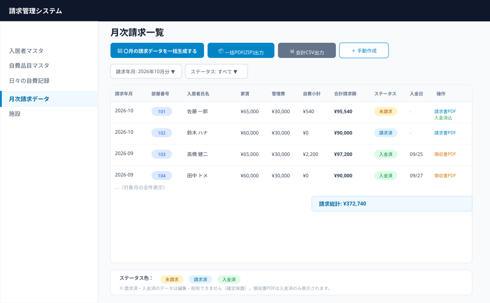
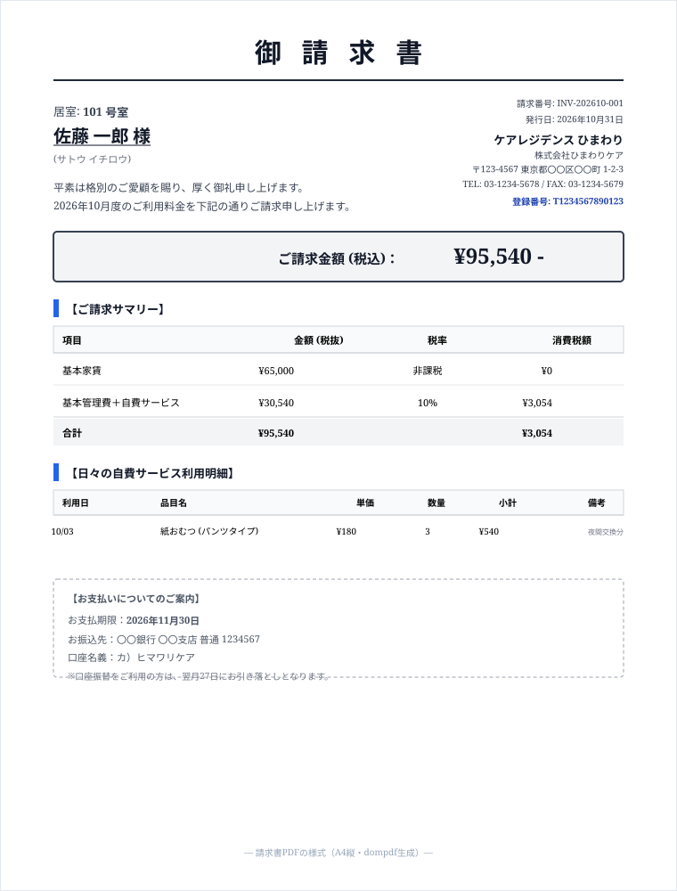
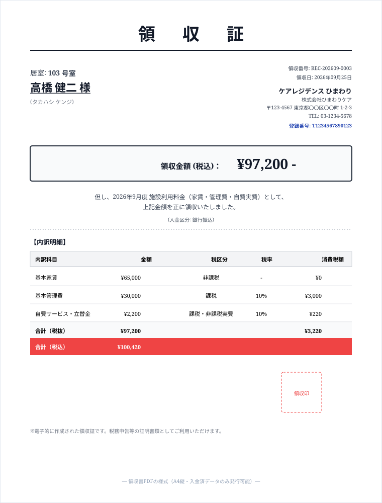

# 高齢者施設請求管理システム「あんしん」操作マニュアル

> **バージョン**: v1.3 "あんしん"（2026-10-09）
> **対象者**: 施設の事務職員・介護職員
> **管理画面URL**: `http://localhost:8000/admin`
> **図版**: `docs/assets/` のSVGモックアップ（実画面と若干異なる場合があります）

---

## 目次

- [第1章 システム概要](#第1章-システム概要)
- [第2章 はじめに（ログイン・画面の見方）](#第2章-はじめにログイン・画面の見方)
- [第3章 ダッシュボード（v1.3 新機能）](#第3章-ダッシュボードv13-新機能)
- [第4章 セットアップウィザード（v1.3 新機能）](#第4章-セットアップウィザードv13-新機能)
- [第5章 日常業務：日々の自費記録](#第5章-日常業務日々の自費記録)
- [第6章 入居者マスタ](#第6章-入居者マスタ)
- [第7章 自費品目マスタ](#第7章-自費品目マスタ)
- [第8章 月次請求業務](#第8章-月次請求業務)
- [第9章 PDF・CSV出力リファレンス](#第9章-pdfcsv出力リファレンス)
- [第10章 施設情報設定](#第10章-施設情報設定)
- [第11章 Q&A（トラブルシューティング）](#第11章-qaトラブルシューティング)
- [第12章 用語集・計算式リファレンス](#第12章-用語集計算式リファレンス)
- [付録：初期データと計算例](#付録初期データと計算例)

---

## 第1章 システム概要

### 1.1 このシステムでできること

「あんしん」は高齢者施設の**月次請求・領収書発行・入居者管理・日々の利用料管理**をひとつの管理画面で行うシステムです。

| 業務 | システムでの操作 |
| --- | --- |
| 入居者の登録・変更 | 入居者マスタ（部屋番号・氏名・家賃・管理費・入居/退去日） |
| 紙おむつ・理美容代などの記録 | 日々の自費記録（日付 × 品目 × 単価 × 数量） |
| 毎月の請求額計算 | 月次請求データ一括生成（家賃・管理費は日割り計算、自費は自動合算） |
| 請求の進捗確認 | ダッシュボード（進捗バー・未入金アラート） |
| 請求書の発行 | 請求書PDF（個別）／全員分ZIP（一括） |
| 入金の確認 | 入金消込（入金日・入金区分を記録） |
| 領収書の発行 | 領収書PDF（入金済データのみ） |
| 会計ソフトへの連携 | 会計仕訳CSV／請求一覧台帳CSV |
| 初期導入 | セットアップウィザード（5ステップ） |

### 1.2 画面構成（メニュー）

管理画面の左側メニューは次のとおりです（v1.3で「ダッシュボード」「セットアップウィザード」を追加）。

| メニュー | 用途 | 使う頻度 |
| --- | --- | --- |
| ダッシュボード | 請求進捗・未入金者の確認（v1.3 新機能） | 毎日 |
| セットアップウィザード | 初期導入のガイド（v1.3 新機能） | 導入時のみ |
| 入居者マスタ | 入居者の登録・編集・退去処理 | 入居・退去時 |
| 自費品目マスタ | 請求品目とデフォルト単価の管理 | 品目追加時 |
| 日々の自費記録 | 自費利用の記録入力 | 毎日 |
| 月次請求データ | 月次請求・PDF・入金消込・CSV | 毎月 |
| 会計連携設定 | 勘定科目マスタ・エクスポートプロファイル管理 | 導入時・設定変更時 |
| 施設 | 施設情報のDB管理（参考） | 変更時 |

### 1.3 業務フロー全体




### 1.4 請求ステータスの3段階

請求データは次の3ステータスを遷移します。**「請求済」「入金済」は確定済みとして保護**され、編集・削除はできません。



| ステータス | 色 | 意味 | できる操作 |
| --- | --- | --- | --- |
| 未請求 | 黄 | 一括生成で作成された直後 | 編集・削除・再計算・PDF出力・入金消込 |
| 請求済 | 青 | 請求書を発行・送付済み | PDF出力・入金消込（編集・削除不可） |
| 入金済 | 緑 | 入金確認済み | 領収書PDF出力（編集・削除不可） |

---

## 第2章 はじめに（ログイン・画面の見方）

### 2.1 ログイン

1. ブラウザで `http://localhost:8000/admin` を開く
2. メールアドレスとパスワードを入力し「ログイン」をクリック



**初期アカウント（シードデータ）**

| 項目 | 値 |
| --- | --- |
| メールアドレス | `admin@care-himawari.example.jp` |
| パスワード | `password` |

> ⚠️ 管理画面には **管理者権限（`is_admin = true`）を持つアカウントのみ** アクセスできます。権限のないアカウントではログイン画面は表示されても管理画面には入れません。

### 2.2 画面の見方

- **左側メニュー**: 業務ごとの画面に移動します
- **一覧画面**: テーブルの見出しをクリックすると並び替え、虫眼鏡アイコンで検索、列の見出し右の「≡」で表示列を切替
- **バッジ（色付きラベル）**: ステータスや部屋番号を示します
  - 緑=入居中／入金済、青=請求済、黄=未請求、グレー=退去
- **行の操作**: テーブル右端のアイコン（鉛筆=編集、アイコン付きボタン=PDF出力など）

### 2.3 ログアウト

画面右上のユーザーアイコン（◯）をクリック → 「ログアウト」を選択します。

### 2.4 スマホ・タブレットからの操作

管理画面はスマホ・タブレットにも対応しています（Filamentのレスポンシブ設計）。

| 画面要素 | スマホ（幅768px未満）での動作 |
| --- | --- |
| サイドバーメニュー | 画面幅 **1024px未満**で非表示になり、トップバーの **≡（ハンバーガー）ボタン**から開くドロワーに変わります（開いている間は薄い暗いオーバーレイが表示されます） |
| 一覧テーブル | **横スクロール**で表示します（列が多い画面は右にスワイプ） |
| タブ（入居者マスタの「入院中／すべて／退去済」） | 横スクロールで表示します |
| ドロップダウン・日付選択 | タッチ操作対応のカスタム選択画面になります（`native(false)`設定） |
| 入力フォームの列数 | 画面幅に応じて自動切替（**640px未満は1列**／640px以上で2列／1024px以上で2〜3列） |

**操作上の注意**

- 月次請求一覧は列が多いため、スマホでは横スクロールが必要です。**金額確認や一括操作はタブレット・PCが推奨**されます
- 日々の自費記録の入力はスマホでも問題なく行えます（品目を選ぶと単価が自動反映されます）
- 請求書・領収書のPDFダウンロードはモバイルブラウザでも動作します

---

## 第3章 ダッシュボード（v1.3 新機能）

### 3.1 ダッシュボードとは

ダッシュボードは**請求業務の進捗を一目で把握する画面**です。毎朝の業務開始時に確認すると、請求漏れや未入金を早期に発見できます。

### 3.2 表示内容

| ブロック | 内容 |
| --- | --- |
| 請求進捗バー | 対象月の「請求済＋入金済」の割合をパーセントで表示 |
| 件数サマリー | 対象件数／請求済／未請求／入金済の件数 |
| 未入金アラート | 未入金の入居者一覧（督促対象の早期発見） |
| クイック統計 | 入居者数・今月の請求総額などの概要 |
| 年月セレクタ | 過去12ヶ月＋未来3ヶ月から対象月を切替 |

### 3.3 使い方

1. 左メニュー「ダッシュボード」を開く
2. 右上の年月セレクタで対象月を選ぶ
3. 進捗バーと未入金アラートを確認する

> 💡 **施設管理者**（施設ごとの管理者権限を持つユーザー）でログインした場合は、**自分の施設のデータのみ**が表示されます。全体管理者は全施設のデータを確認できます。

### 3.4 業務での活用例

- **毎朝の確認**: 「未入金アラート」で督促対象を把握し、電話・案内状で対応
- **月末の締め**: 進捗が100%になるまで「請求済」変更と入金消込を進める
- **月次報告**: 件数サマリーをそのまま報告資料に転用

---

## 第4章 セットアップウィザード（v1.3 新機能）

### 4.1 セットアップウィザードとは

新規導入時の初期設定を**5ステップでガイドする画面**です。手順に沿って入力するだけで、請求業務を始めるための最低限の設定が完了します。

### 4.2 ステップ構成

| ステップ | 内容 |
| --- | --- |
| Step1 施設情報 | 施設名・運営法人名・インボイス登録番号・電話・メール・住所・銀行口座 |
| Step2 請求品目 | プリセット6種（おむつ/理美容/受診付き添い等）から使用する品目を選択 |
| Step3 入居者取込 | 入居者CSVの一括取込（プレビューで内容を確認してから実行） |
| Step4 会計連携 | 会計ソフト（freee/MF/弥生/勘定奉行）を選択し、プロファイルを自動作成 |
| Step5 完了 | 設定内容の確認と完了 |

### 4.3 使い方

1. 左メニュー「セットアップウィザード」を開く
2. 「次へ」ボタンでステップを進める
3. Step3のCSV取込は、ファイルを選択するとプレビューが表示されるので、内容を確認してから実行
4. Step5で完了後、ダッシュボードから業務を開始

> 💡 **プリセット品目**: おむつ（紙おむつ）¥200、おむつ（布おむつ）¥100、理美容（散髪）¥3,000、受診付き添い¥1,500、リハビリ補助¥2,000、外出付き添い¥2,500。選択した品目が自費品目マスタに自動登録されます。

> ⚠️ セットアップウィザードは**初期導入時のみ**使用します。既に運用中の施設は、通常のメニュー（入居者マスタ・自費品目マスタ等）から設定してください。

---

## 第5章 日常業務：日々の自費記録

### 5.1 概要

家賃・管理費以外の利用料（紙おむつ、理美容代、受診付き添い費など）を**日付単位**で記録します。この記録が月次請求の「自費サービス小計」として自動合算されます。

### 5.2 記録の入力手順

1. 左メニュー「日々の自費記録」を開く
2. 右上「＋ 自費記録を登録」をクリック
3. 次の項目を入力し「保存」



| 項目 | 入力のポイント |
| --- | --- |
| 日付 | 利用日を選択（**入居者の在籍期間内**である必要があります） |
| 入居者 | ドロップダウンから選択（**入居中の入居者のみ**表示されます） |
| 品目 | 選択すると**デフォルト単価が自動反映**されます |
| 単価 | 品目選択時に自動セットされますが、個別に変更も可能です |
| 数量 | 1以上の整数（例：紙おむつ3枚） |
| 小計金額 | 単価 × 数量が**自動表示**されます（確認用） |
| 備考 | 任意（例：夜間交換分、家族持参分） |

### 5.3 一覧の見方・絞り込み

- **対象年月フィルタ**: 直近12ヶ月から選択（デフォルトは当月）
- **入居者フィルタ**: 入居者を指定して絞込
- **品目フィルタ**: 有効な品目から選択
- テーブルの「小計」列は 単価×数量 を表示します

### 5.4 修正・削除

一覧の行の右端にある **✎（編集）** または **🗑（削除）** アイコンをクリックします。

> ⚠️ **在籍期間外エラーについて**: 入居日より前・退去日より後の日付を入力すると「利用日が入居者の在籍期間外です」というエラーになります。入居日〜退去日の範囲内で入力し直してください。

---

## 第6章 入居者マスタ

### 6.1 新規入居者の登録

1. 左メニュー「入居者マスタ」を開く
2. 右上「＋ 新規入居者登録」をクリック
3. フォームに入力し「保存」



| 項目 | 必須 | 説明 |
| --- | --- | --- |
| 部屋番号 | ◯ | 10文字以内（例: 101） |
| ステータス | ◯ | 入事中／退去（新規は「入事中」） |
| 氏名 | ◯ | 255文字以内 |
| フリガナ | 任意 | 一覧の氏名の下に表示されます |
| 入居開始日 | ◯ | 日割り計算の基準になります |
| 退去日 | 任意 | 未定は空欄。**入居日以降**の日付を入力 |
| 基本家賃(月額) | ◯ | 毎月の固定家賃（税込） |
| 基本管理費(月額) | ◯ | 毎月の固定管理費（税込） |

### 6.2 一覧の見方



- **タブ切替**: 「入院中（デフォルト）／すべて／退去済」をワンタップで切替。各タブのバッジは件数を表示します
- **検索**: 部屋番号・氏名・フリガナで検索できます
- **月額固定計**: 基本家賃＋基本管理費の合計（太字表示）
- **ステータスフィルタ**: 一覧右上のフィルタからも絞り込めます

### 6.3 編集・退去処理

- **編集**: 一覧の行の ✎ アイコンをクリック
- **退去処理**: 編集画面で「ステータス」を「退去」に変更し、退去日を入力して保存
- **削除**: 入居者マスタには削除機能はありません（請求履歴を保護するため）。退去はステータス変更で対応してください

> 💡 **月途中の入居・退去**は問題ありません。月次請求では在籍日数で**日割り計算**されます（詳細は第8章・第12章）。

---

## 第7章 自費品目マスタ

### 7.1 品目の登録

1. 左メニュー「自費品目マスタ」を開く
2. 右上「＋」（新規作成）をクリック
3. 品目名・デフォルト単価・有効を設定し「保存」

| 項目 | 説明 |
| --- | --- |
| 品目名 | 例: 紙おむつ (パンツタイプ)、理美容代 (カット) |
| デフォルト単価 | 日々の記録入力時に自動セットされる基準単価 |
| 有効 | ON の品目のみ記録画面で選択できます |

### 7.2 デフォルト単価の考え方

- **金額が固定の品目**（例：理美容代 カット 2,200円）→ 単価を設定
- **都度異なる品目**（例：日用品・嗜好品立替金）→ **単価を 0 にする**（記録画面で都度入力）

> 💡 品目名に「立替金」「日用品」を含めると、フォームに「立替金・日用品の場合は0とし、実際の金額は日々の記録で入力してください。」と案内が表示されます。

### 7.3 編集・削除

- **編集**: 行の ✎ アイコン
- **削除**: 一覧左のチェックボックスで選択し、一括削除

> ⚠️ 既に日々の記録で使われている品目を削除すると、記録の品目表示に影響します。使わなくなった品目は「有効」をOFFにするのが安全です。

---

## 第8章 月次請求業務

### 8.1 月次業務の全体像

毎月の業務は次の流れです。詳細は各ステップで説明します。


### 8.2 Step② 月次請求データの一括生成

**タイミング**: 翌月1日以降、対象月の自費記録が揃ったら

1. 左メニュー「月次請求データ」を開く
2. 右上「🧮 〇月の請求データを一括生成する」をクリック
3. 対象年月を選択し「一括生成を実行する」



**実行結果の通知**（画面右上に表示）:

```
【2026-10分】
新規作成: 25件
再計算更新: 0件
スキップ(確定済): 0件
```

| 結果 | 意味 |
| --- | --- |
| 新規作成 | 初めて生成された件数 |
| 再計算更新 | 既存の未請求データが再計算された件数 |
| スキップ(確定済) | 請求済・入金済のため再計算されなかった件数 |

**「確定済みのデータも上書き再計算する」（強制更新）について**

- 通常はOFF：未請求・新規データのみ再計算され、確定済みは保護されます
- ONにするのは**金額に修正があった場合のみ**（例：家賃を間違えていた）

**計算ロジック（自動）**:

1. 対象月に在籍していた入居者（月中入居・月中退去を含む）が対象
2. 家賃・管理費 = 月額 ÷ その月の日数 × 在籍日数（四捨五入）
3. 自費小計 = 対象月の日々の記録（単価×数量）の合計
4. 合計請求額 = 家賃 + 管理費 + 自費

### 8.3 Step③ 金額確認

一覧で次を確認します。

- **合計請求額**（太字）と一覧下部の「請求総計」
- **ステータス**が「未請求」になっていること
- フィルタで対象月・ステータスを絞り込んで確認

金額がおかしい場合の対処：

1. 自費記録の入力漏れ・重複を確認（第5章）
2. 入居者の家賃・管理費・在籍期間を確認（第6章）
3. 「一括生成」を強制更新ONで再実行

### 8.4 Step④ 請求書PDF出力

**個別出力**: 一覧の行の「📥 請求書PDF」アイコンをクリック → PDFがダウンロードされます

**一括出力（全員分ZIP）**:

1. 右上「📦 一括PDF(ZIP)出力」をクリック
2. 対象年月を選択 → ダウンロード

ファイル名の例:
- 個別: `請求書_2026-10_101号室_佐藤 一郎様.pdf`
- ZIP: `請求書一括_2026-10.zip`（ZIP内: `【101号室】佐藤 一郎様_請求書_2026-10.pdf`）

請求書の様式は第9章を参照してください。

### 8.5 Step⑤ 一括「請求済」に変更

請求書を送付したら、ステータスを確定させます。

1. 一覧左のチェックボックスで対象レコードを選択（全選択も可）
2. 一括操作から「一括『請求済』に変更」を選択
3. 確認ダイアログで実行

> ⚠️ 「請求済」にすると**編集・削除できなくなります**。送付前に金額を必ず確認してください。

### 8.6 Step⑥ 入金消込

入金を確認したら消込処理を行います。

1. 一覧の行の「✅ 入金消込」アイコンをクリック（未入金のレコードのみ表示）
2. 入金確認日（デフォルトは今日）と入金区分を選択
3. 実行 → ステータスが「入金済」に変わり、**領収書番号が自動発行**されます

| 入金区分 | 説明 |
| --- | --- |
| 銀行振込 | お振込での入金 |
| 口座振替 | 翌月の口座振替（一括消込でも使用） |
| 現金 | 現金での入金 |

**一括入金消込**: チェックボックスで選択し「一括『入金済（口座振替）』に変更」で、口座振替として一括消込できます。

> 💡 入金消込が完了すると通知に領収書番号が表示されます（例: `入金消込が完了しました (領収書番号: REC-202610-0001)`）。

### 8.7 Step⑦ 領収書PDF出力

入金済のレコードに「🧾 領収書PDF」アイコンが表示されます。クリックしてダウンロードします。

ファイル名の例: `領収証_2026-10_101号室_佐藤 一郎様.pdf`

> ⚠️ 領収書PDFは**入金済のレコードにのみ**表示されます。未入金の領収書は発行できません。

### 8.8 Step⑧ 会計CSV出力（v1.2 拡張）

1. 右上「📊 会計CSV出力」をクリック
2. 対象年月・会計ソフト・エクスポートプロファイルを選択

| 出力種別 | 内容 | 用途 |
| --- | --- | --- |
| 会計仕訳連携用CSV | 売掛金／賃貸料収入・施設管理費収入・自費立替金収入の仕訳 | 弥生会計・freee・MF・勘定奉行等への取り込み |
| 請求・入金一覧CSV | 請求・入金の全項目台帳 | Excelで確認・保管 |

**v1.2 新機能：会計ソフト別プロファイル対応**

| 会計ソフト | 文字コード | 改行 | BOM | 主な特徴 |
| --- | --- | --- | --- | --- |
| freee | UTF-8 | CRLF | あり | 科目コード・補助科目・部門・タグコード全対応 |
| MFクラウド会計 | UTF-8 | CRLF | あり | 科目コード・補助科目・部門対応 |
| 弥生会計 | Shift_JIS | CRLF | なし | 科目コード・補助科目・部門対応 |
| 勘定奉行 | Shift_JIS | CRLF | なし | 科目コード・補助科目・部門対応（簡易形式） |

**v1.2 新機能：仕訳プレビュー**

- 「会計仕訳プレビュー」アクションで出力内容を事前確認可能
- 借方・貸方の合計金額が一致するか（仕訳の平衡確認）を表示
- 確認後「CSVダウンロード」ボタンで出力

**v1.2 新機能：勘定科目マスタ・プロファイル管理**

- 管理画面左メニュー「会計連携設定」→「勘定科目マスタ」で施設ごとの借方/貸方科目コードを管理
- 同「会計エクスポート設定」で会計ソフト別の出力フォーマット（ヘッダー名、税区分コード変換、デフォルト値等）をカスタマイズ
- デフォルト値はシーダーで自動作成されます（初回セットアップ時に `php artisan db:seed --class=AccountingExportSeeder` 実行）

> 💡 会計仕訳CSVは**「請求済」「入金済」のデータのみ**が対象です（未請求は仕訳に含みません）。

### 8.9 確定済みデータの保護

「請求済」「入金済」のデータは**編集・削除できません**（確定保護）。

- 修正が必要な場合 → 「一括生成」で強制更新ONを付けて再計算
- 強制更新でも再計算されない場合 → 管理者に相談（データの直接修正が必要な可能性）

### 8.10 請求書・領収書の日付指定（v1.3 新機能）

請求書と領収書の**日付**は、従来は自動（請求年月・入金日）で決まっていましたが、v1.3 から**任意の日付を指定**できるようになりました。

| モード | 請求書日付 | 領収書日付 |
| --- | --- | --- |
| 自動（`auto`・デフォルト） | 請求年月に基づく | 入金日に基づく |
| 任意（`manual`） | `custom_invoice_date` で指定 | `custom_receipt_date` で指定 |

**使い方**: 月次請求データの編集画面で「請求書日付モード」または「領収書日付モード」を「任意の日付を指定」に変更し、日付を入力します。

> 💡 **活用例**: 請求書の発行日を翌月の定例日に揃えたい場合、領収書の日付を実際の入金日とは別の日付にしたい場合に使用します。

### 8.11 税額内訳の詳細表示（v1.3 新機能）

v1.3 から、消費税額を**標準税率（10%）と軽減税率（8%）で別々に管理**します。

- `monthly_invoices.tax_breakdown` に税率別の課税対象額・税額を保存
- 請求書PDFの「ご請求サマリー」に税率別の内訳を表示

| 税率 | 対象 |
| --- | --- |
| 標準税率 10% | 基本管理費・自費サービス（通常のサービス） |
| 軽減税率 8% | 軽減税率対象の品目（設定されている場合） |

> 💡 通常の施設では標準税率（10%）のみが適用されます。軽減税率は、品目マスタで軽減税率を設定した場合にのみ使用されます。

---

## 第9章 PDF・CSV出力リファレンス

### 9.1 請求書PDFの構成



| ブロック | 内容 |
| --- | --- |
| 宛先 | 居室番号・氏名・フリガナ |
| 発行者 | 施設名・運営者・住所・TEL/FAX・インボイス登録番号 |
| ご請求金額（税込） | 家賃 + 管理費 + 自費 + 消費税 |
| ご請求サマリー | 基本家賃（非課税）／管理費+自費（課税10%）／消費税額（**v1.3: 税率別内訳表示**） |
| 日々の自費サービス利用明細 | 利用日・品目名・単価・数量・小計・備考 |
| お支払いについて | お支払期限（翌月末）・振込先・口座振替日の案内 |

**請求番号の形式**: `INV-YYYYMM-XXX`（例: INV-202610-001）

**v1.3**: 請求書日付は「請求書日付モード」で自動/任意を切替可能（第8章 8.10 参照）

### 9.2 領収書PDFの構成



| ブロック | 内容 |
| --- | --- |
| 宛先 | 居室番号・氏名・フリガナ |
| 発行者 | 施設情報・インボイス登録番号 |
| 領収金額（税込） | 入金額 |
| 但し書き | 利用月・入金区分 |
| 内訳明細 | 家賃（非課税）／管理費（課税10%）／自費（課税）／消費税額 |

**領収番号の形式**: `REC-YYYYMM-XXXX`（例: REC-202610-0001）

**v1.3**: 領収書日付は「領収書日付モード」で自動/任意を切替可能（第8章 8.10 参照）

### 9.3 税区分のルール

| 項目 | 税区分 |
| --- | --- |
| 基本家賃 | **非課税** |
| 基本管理費 | 課税 10% |
| 自費サービス | 課税 10%（実費） |

- 課税対象額 = 管理費 + 自費
- 消費税額 = 課税対象額 × 10%（四捨五入）
- 税込合計 = 家賃 + 課税対象額 + 消費税額

### 9.4 CSVの文字コード

CSVは **UTF-8（BOM付き）** で出力されるため、Excelで文字化けせずに開けます。

---

## 第10章 施設情報設定

### 10.1 請求書・領収書に表示される施設情報

請求書・領収書に表示される施設情報は、**`.env` ファイルの `FACILITY_*` 設定**から取得されます（管理画面の「施設」メニューはDB上の施設マスタ管理用で、PDF表示には使われません）。

| 設定項目 | 内容 | 例 |
| --- | --- | --- |
| `FACILITY_NAME` | 施設名 | ケアレジデンス ひまわり |
| `FACILITY_OPERATOR` | 運営者名 | 株式会社ひまわりケア |
| `FACILITY_POSTAL_CODE` | 郵便番号 | 123-4567 |
| `FACILITY_ADDRESS` | 住所 | 東京都〇〇区〇〇町 1-2-3 |
| `FACILITY_PHONE` / `FACILITY_FAX` | 電話・FAX | 03-1234-5678 |
| `FACILITY_INVOICE_NUMBER` | インボイス登録番号 | T1234567890123 |
| `FACILITY_BANK_*` | 銀行口座情報 | 銀行名・支店・種別・番号・名義 |
| `FACILITY_DEBIT_DAY` | 口座振替日 | 27 |
| `FACILITY_TRANSFER_DUE_DAYS` | 支払期限日数 | 30 |

### 10.2 施設情報の変更

1. サーバーの `.env` ファイルを編集
2. キャッシュをクリア: `php artisan config:clear`

> ⚠️ **インボイス登録番号は「T + 13桁数字」の形式**（例: T1234567890123）です。形式が不正な場合、システム起動時にエラーになります。銀行情報（名称・口座番号・名義）も必須です。

---

## 第11章 Q&A（トラブルシューティング）

### ログイン・アクセス

**Q1. ログイン画面が開きません**
- URLが `http://localhost:8000/admin` か確認してください
- システムが起動しているか確認してください（起動していない場合は管理者に確認）
- ブラウザのキャッシュをクリアして再試行してください

**Q2. パスワードを忘れました**
- 初期パスワードは `password` です（初期アカウント: `admin@care-himawari.example.jp`）
- 変更後のパスワードを忘れた場合は管理者に連絡してください

**Q3. ログインできるがメニューが表示されません**
- 管理画面は `is_admin = true` のアカウントのみアクセスできます。権限のないアカウントでは利用できません

**Q4. 別のPCからアクセスできますか**
- サーバーのURLに `/admin` を付けたURLからアクセスできます（例: `http://<サーバーIP>:8000/admin`）。ファイアウォール・ネットワーク設定は管理者に確認してください

### 入居者管理

**Q5. 新しい入居者を登録するには**
- 「入居者マスタ」→「＋ 新規入居者登録」から登録します（第6章参照）

**Q6. 退去の手続きをするには**
- 入居者マスタの編集画面で「ステータス」を「退去」に変更し、退去日を入力して保存します。退去後も請求履歴は残ります

**Q7. 月の途中で入居・退去した場合の計算は**
- 在籍日数で日割り計算されます。例: 31日の月に15日間在籍 → 月額 ÷ 31 × 15（四捨五入）

**Q8. 退去日の日付が入力できません（エラーになる）**
- 退去日は**入居日以降**の日付を入力してください。入居日より前の日付は入力できません

### 日々の自費記録

**Q9. 「利用日が入居者の在籍期間外です」というエラーが出ます**
- 入居日〜退去日の範囲内の日付を入力してください。入居日や退去日の変更が必要な場合は入居者マスタを修正してください

**Q10. 品目を選ぶと単価が自動入力されるのはなぜですか**
- 自費品目マスタで設定した「デフォルト単価」が自動反映されます。金額が異なる場合は手動で変更できます

**Q11. 新しい品目を追加したい**
- 「自費品目マスタ」で新規登録してください。登録後は日々の自費記録の品目ドロップダウンに表示されます（「有効」ONのもののみ）

**Q12. 記録を間違えた場合**
- 一覧の ✎（編集）で修正、🗑（削除）で削除してください。修正後は月次請求を再計算（強制更新）してください

### 月次請求

**Q13. 請求データを生成するタイミングは**
- 翌月1日以降、対象月の自費記録が揃った時点で実行します。生成後は金額確認 → 請求書PDF出力 → 「請求済」変更の手順で進めます

**Q14. 一括生成の結果「スキップ(確定済)」と表示されます**
- 請求済・入金済のデータは保護されているため再計算されません。金額を修正したい場合は「確定済みのデータも上書き再計算する（強制更新）」をONにしてください

**Q15. 金額が合わない気がします**
- 次を確認してください:
  1. 自費記録の入力漏れ・重複（日々の自費記録一覧で対象月を絞り込んで確認）
  2. 入居者の家賃・管理費（入居者マスタ）
  3. 在籍期間（入居日・退去日）
- それでも合わない場合は管理者に報告してください

**Q16. 確定済み（請求済・入金済）のデータを修正したい**
- 画面からは編集・削除できません。「月次請求データ」の一括生成で強制更新ONを付けて再計算してください。それでも修正できない場合は管理者に相談してください

**Q17. 請求書を再発行したい**
- 月次請求一覧の「📥 請求書PDF」から何度でも再発行できます

**Q18. 全員分の請求書を一度に出したい**
- 「📦 一括PDF(ZIP)出力」で全員分が1つのZIPファイルでダウンロードできます

### 入金・領収書

**Q19. 入金消込のやり方**
- 月次請求一覧の「✅ 入金消込」から入金確認日と入金区分を選択するだけです。複数件まとめる場合はチェックボックス選択 →「一括『入金済（口座振替）』に変更」も使えます

**Q20. 入金消込を取り消したい**
- 画面からは取り消し（未請求・請求済への戻し）機能はありません。誤って消込した場合は管理者に連絡してください

**Q21. 領収書PDFが表示されません**
- 領収書PDFは**入金済のレコードにのみ**表示されます。入金消込が済んでいるか確認してください

**Q22. 領収書番号のルールを教えてください**
- `REC-YYYYMM-XXXX` の形式で、入金消込時に自動発行されます（例: REC-202610-0001）

### CSV・会計連携

**Q23. CSVを開くと文字化けします**
- CSVはUTF-8（BOM付き）で出力されています。Excelで開いて文字化けする場合は、Excelの「データ」→「テキストまたはCSVから」で取り込み、文字コードを「65001: Unicode (UTF-8)」を選択してください

**Q24. 会計ソフトに取り込むには**
- 「📊 会計CSV出力」→「会計仕訳連携用CSV」を出力し、会計ソフトのCSV取り込み機能で読み込みます。**v1.2では「会計ソフト」（freee/MF/弥生/勘定奉行）と「エクスポートプロファイル」を選択可能**です。借方=売掛金、貸方=賃貸料収入／施設管理費収入／自費立替金収入の仕訳形式です

**Q25. 会計仕訳CSVに一部のデータが含まれません**
- 会計仕訳CSVは**「請求済」「入金済」のデータのみ**が対象です。未請求のデータは含まれません

**Q26. 勘定科目コードを変更したい（v1.2新機能）**
- 管理画面左メニュー「会計連携設定」→「勘定科目マスタ」から、施設ごと・品目ごとの借方/貸方科目コード・補助科目・部門・税区分を設定できます。デフォルトは家賃=売掛金/賃貸料収入、管理費=売掛金/施設管理費収入、自費=売掛金/自費立替金収入です

**Q27. 会計ソフトごとの出力形式を調整したい（v1.2新機能）**
- 同「会計エクスポート設定」から、会計ソフト種類（freee/MF/弥生/勘定奉行）ごとのプロファイルを編集可能です。ヘッダー名、必須/任意フィールド、税区分コード変換、文字コード（UTF-8/Shift_JIS）、改行コード、BOM有無などをカスタマイズできます

**Q28. 出力前に中身を確認したい（v1.2新機能）**
- 「会計CSV出力」モーダルの「会計仕訳プレビュー」ボタンから、仕訳行・借方合計・貸方合計・平衡確認を事前に見られます。問題なければ「CSVダウンロード」で出力します

### ダッシュボード・セットアップ（v1.3 新機能）

**Q29. 請求の進捗を確認するには（v1.3新機能）**
- 左メニュー「ダッシュボード」を開きます。対象月の進捗バー、件数サマリー、未入金アラートが表示されます。年月セレクタで過去12ヶ月＋未来3ヶ月を切替可能です

**Q30. 未入金の入居者を一覧で見たい（v1.3新機能）**
- ダッシュボードの「未入金アラート」に未入金の入居者が一覧表示されます。督促対応の目安としてご利用ください

**Q31. 初期導入を手順に沿ってやりたい（v1.3新機能）**
- 左メニュー「セットアップウィザード」から5ステップで初期設定できます。施設情報→請求品目プリセット選択→入居者CSV取込→会計ソフト連携→完了の流れです

**Q32. 請求書の日付を任意の日付にしたい（v1.3新機能）**
- 月次請求データの編集画面で「請求書日付モード」を「任意の日付を指定」に変更し、日付を入力します。領収書も同様に「領収書日付モード」で切替可能です（第8章 8.10 参照）

**Q33. 消費税を軽減税率で計算したい（v1.3新機能）**
- 品目マスタで品目の税区分を「軽減税率」に設定すると、請求時に標準税率（10%）と軽減税率（8%）を別々に計算します。請求書PDFのサマリーに税率別の内訳が表示されます

### 施設情報・その他

**Q34. 施設名や銀行口座を変えたい**
- `.env` の `FACILITY_*` を編集し、`php artisan config:clear` を実行してください（管理者作業）。管理画面の「施設」メニューではなく `.env` が請求書に反映されます

**Q35. インボイス登録番号の形式が分かりません**
- 「T + 13桁数字」です（例: T1234567890123）。形式が不正だとシステムが起動しません

**Q36. データのバックアップは必要ですか**
- 必要です。SQLiteを使用している場合は `database/database.sqlite` ファイルを、MySQLの場合はデータベースをバックアップしてください。バックアップの運用は管理者に確認してください

**Q37. 複数人で同時に操作できますか**
- はい。ただし同じレコードへの同時編集は避けてください。月次請求の再計算はバージョン管理（楽観ロック）で競合を検出し、競合時はスキップされます

**Q38. 初期データには何が入っていますか**
- 管理者アカウント1名、自費品目7種、入居者25名（部屋番号101〜215）、当月・先月分の請求データ（先月分は5件入金済）が登録されています。実運用開始前には初期データを整理してください

### スマホ・タブレット

**Q39. スマホやタブレットから操作できますか**
- はい。管理画面はレスポンシブ対応しています
  - メニューは **≡（ハンバーガー）ボタン**から開きます（1024px未満）
  - 一覧テーブルは横スクロールで表示します
  - 入力フォームはスマホでは1列に自動配置されます
  - ドロップダウン・日付選択はタッチ操作に対応しています

**Q40. スマホでの操作で気をつけることは**
- 月次請求一覧は列が多いので横スクロールが必要です。金額確認や一括操作（「請求済」変更・一括入金消込）は**タブレット・PCでの実施を推奨**します
- 日々の自費記録の入力はスマホでも行えます

**Q41. タブレットとPCで画面が変わる理由は**
- 画面幅に応じて自動でレイアウトが変わります（入力フォームは640px未満で1列、640px以上で2列、1024px以上で2〜3列）。不具合ではなく正常な動作です

---

## 第12章 用語集・計算式リファレンス

### 12.1 用語集

| 用語 | 説明 |
| --- | --- |
| 入居者マスタ | 入居者の基本情報（部屋番号・氏名・家賃・管理費・在籍期間）を管理する画面 |
| 自費品目マスタ | 家賃・管理費以外の請求品目とデフォルト単価を管理する画面 |
| 日々の自費記録 | 日付単位の自費利用記録（品目 × 単価 × 数量） |
| 月次請求データ | 1ヶ月分の請求額をまとめたデータ（家賃+管理費+自費） |
| 日割り計算 | 月額を在籍日数で按分する計算（月額 ÷ 月の日数 × 在籍日数） |
| 入金消込 | 入金を確認し、ステータスを「入金済」にする処理 |
| 領収書番号 | 入金消込時に自動発行される番号（REC-YYYYMM-XXXX） |
| インボイス登録番号 | 適格請求書発行事業者登録番号（T + 13桁） |
| 強制更新 | 確定済みデータも再計算するオプション |
| 確定保護 | 請求済・入金済データの編集・削除禁止 |
| ダッシュボード | 請求進捗・未入金者を確認する画面（v1.3） |
| セットアップウィザード | 初期導入を5ステップでガイドする画面（v1.3） |
| 請求書日付モード | 請求書の日付を自動/任意で切替する設定（v1.3） |
| 領収書日付モード | 領収書の日付を自動/任意で切替する設定（v1.3） |
| 税額内訳 | 標準税率（10%）・軽減税率（8%）別の税額管理（v1.3） |

### 12.2 計算式

**家賃・管理費（日割り）**

```
在籍日数 = MIN(月末日, 退去日) - MAX(月初日, 入居日) + 1
按分額 = round(月額 ÷ その月の日数 × 在籍日数)
```

**自費小計**

```
自費小計 = Σ(単価 × 数量)  （対象月の全記録）
```

**合計・税**

```
合計請求額(税抜) = 家賃 + 管理費 + 自費
課税対象額 = 管理費 + 自費
消費税額 = round(課税対象額 × 10%)
税込合計 = 家賃 + 課税対象額 + 消費税額
```

**v1.3: 税率別の税額計算（税額内訳）**

```
課税対象額(標準) = 管理費 + 自費(標準税率品目)
課税対象額(軽減) = 自費(軽減税率品目)
消費税額(標準) = round(課税対象額(標準) × 10%)
消費税額(軽減) = round(課税対象額(軽減) × 8%)
消費税額合計 = 消費税額(標準) + 消費税額(軽減)
```

### 12.3 計算例

**例: 31日の月に15日間在籍（家賃65,000円・管理費30,000円・自費540円）**

| 項目 | 計算 | 金額 |
| --- | --- | --- |
| 家賃（非課税） | 65,000 ÷ 31 × 15 = 31,451.6 → 四捨五入 | ¥31,452 |
| 管理費（課税） | 30,000 ÷ 31 × 15 = 14,516.1 → 四捨五入 | ¥14,516 |
| 自費（課税） | 180 × 3 | ¥540 |
| 課税対象額 | 14,516 + 540 | ¥15,056 |
| 消費税額 | 15,056 × 10% | ¥1,506 |
| **税込合計** | 31,452 + 15,056 + 1,506 | **¥48,014** |

---

## 付録：初期データと計算例

### A.1 初期データ（シードデータ）

**自費品目（7種）**

| 品目名 | デフォルト単価 |
| --- | --- |
| 紙おむつ (パンツタイプ) | ¥180 |
| 尿とりパッド | ¥70 |
| 理美容代 (カット) | ¥2,200 |
| 理美容代 (カラー・パーマ) | ¥4,500 |
| 受診付き添い費 (30分) | ¥1,500 |
| 個別洗濯代行 (1回) | ¥500 |
| 日用品・嗜好品立替金 | ¥0（都度入力） |

**入居者**: 25名（部屋番号 101〜115, 201〜215／家賃 60,000〜72,000円／管理費 30,000〜35,000円）

**請求データ**: 当月分（全員未請求）・先月分（5件入金済・領収書検証用）

### A.2 よく使う操作の早見表

| やりたいこと | 操作 |
| --- | --- |
| 進捗を確認する | ダッシュボード（v1.3） |
| 初期導入をする | セットアップウィザード（v1.3） |
| 自費を記録する | 日々の自費記録 → ＋ 自費記録を登録 |
| 今月の請求を作る | 月次請求データ → 〇月の請求データを一括生成する |
| 請求書を出す | 月次請求一覧 → 請求書PDF（個別）／一括PDF(ZIP)出力 |
| 請求したことを記録する | 一括「請求済」に変更 |
| 入金を記録する | 入金消込（入金日・入金区分を選択） |
| 領収書を出す | 領収書PDF（入金済のみ） |
| 会計に渡すデータを作る | 会計CSV出力 |

### A.3 関連文書

| 文書 | 内容 |
| --- | --- |
| `README.md` | システム概要・セットアップ・技術情報・デモ |
| `DEPLOYMENT.md` | デプロイ手順・ロールバック |
| `CHANGELOG.md` | 変更履歴 |
| `docs/実装計画書_操作マニュアル.md` | 本マニュアルの作成計画 |

---

> **マニュアルに関する問い合わせ・改善要望**は管理者までご連絡ください。
> システムの変更時は本マニュアルも更新されます。
